# Tool-Augmented Agents

## Giving AI Agents the Power to Act with Tools

### Language models are strong at reasoning, but without tools, they can only talk—not act. Tools extend an agent’s capabilities beyond text, allowing it to interact with real-world systems like APIs, databases, and mathematical engines.

### Tools function like a utility belt for agents. Without access to tools, an agent can't check real-time data like the weather, do precise calculations, or retrieve company records. It might guess or hallucinate. With tools, agents can reliably perform tasks and fetch accurate, up-to-date information.

### Common types of tools include:
- **Web search APIs** to answer real-time questions
- **Math functions** to ensure precision in calculations
- **APIs and webhooks** to access services like Slack, CRMs, or travel systems
- **Databases (SQL/NoSQL)** to store or retrieve structured data
- **Code execution (e.g., Python)** for transformations, automation, or logic

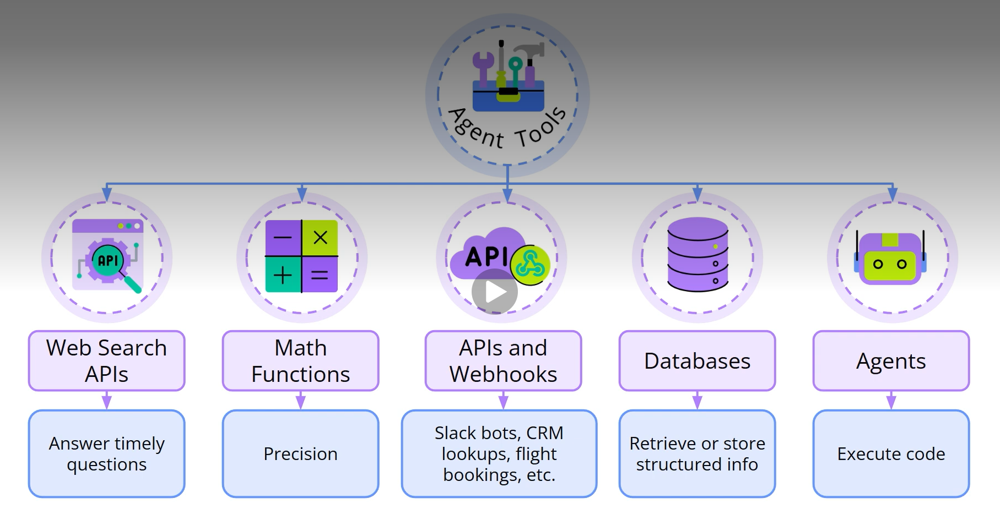
### Early tool integrations used prompt-based cues like “Calling calculator with X and Y,” followed by backend parsing. This approach was fragile and easy to break. A more reliable method is Function Calling, where tools are formally defined and models are trained to use them correctly.
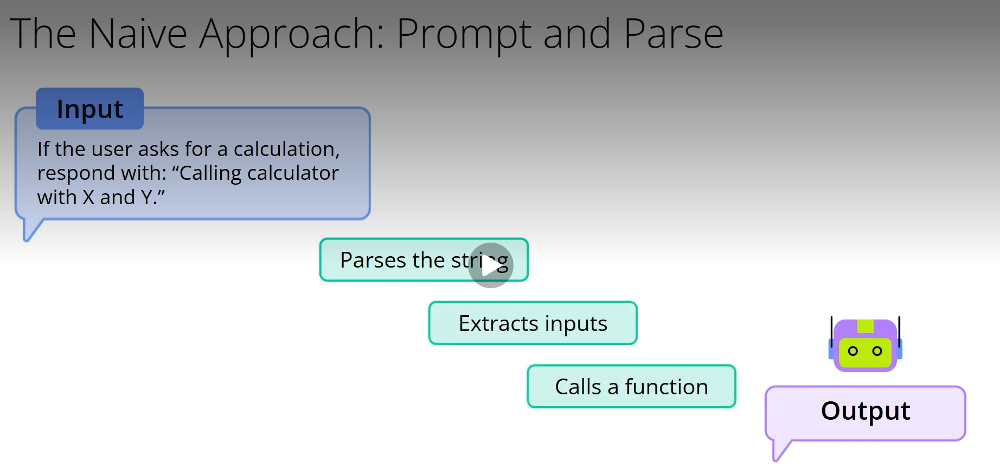

### To enable Function Calling, two components are needed:
1. **A model trained to recognize tool-use situations**, fill in arguments, and format calls in structured JSON.
2. **An API that can detect and handle tool calls**, returning the result to the model.
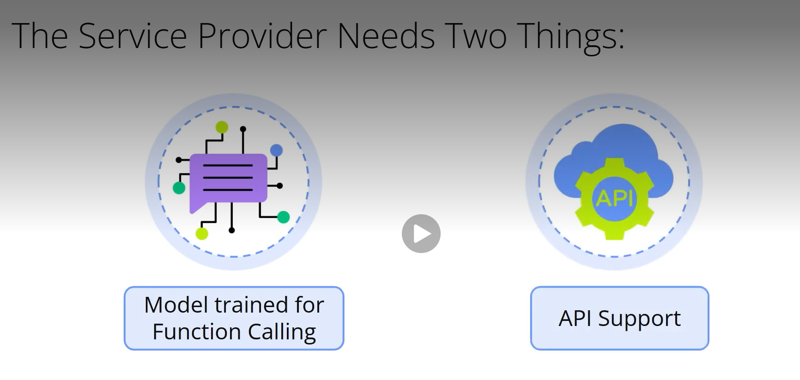
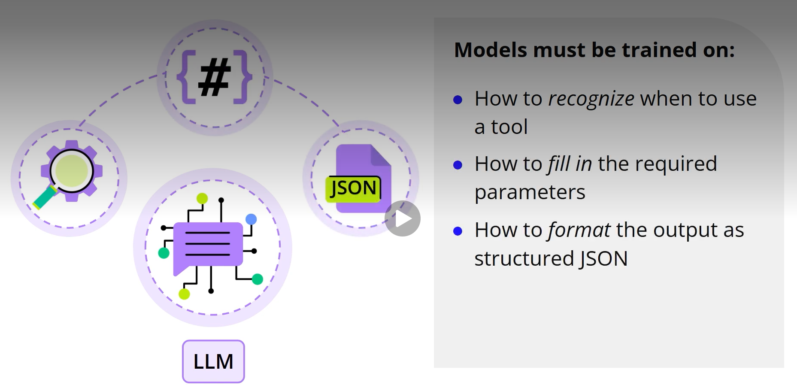
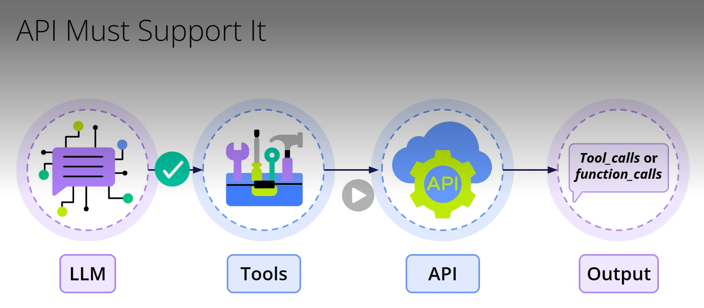
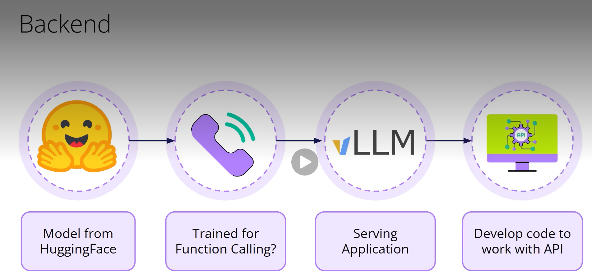
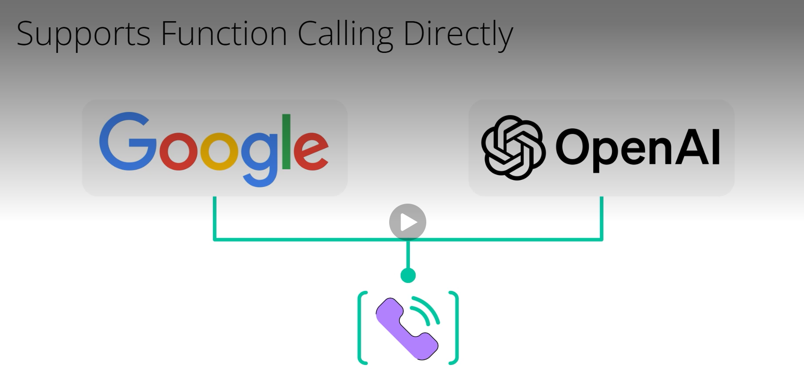
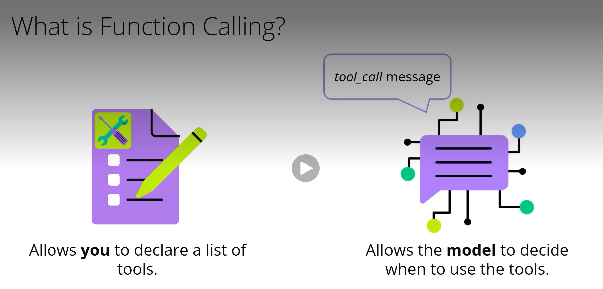
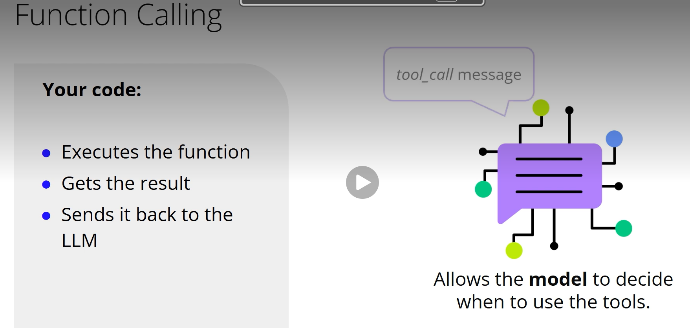
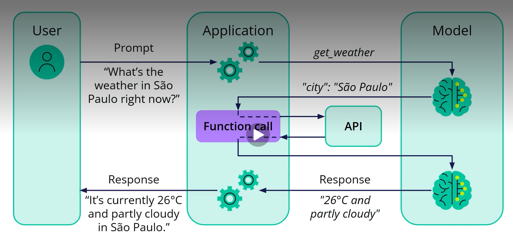
### For example, when a user asks, “What’s the weather in São Paulo?”, the model sends a tool_call to get_weather(city="Sao Paulo"). The backend retrieves the data, returns the result, and the model incorporates it into a natural reply.

### More advanced developments are emerging. OpenAI’s Operator, Anthropic’s Model Context Protocol (MCP), and Google’s Agent-to-Agent (A2A) initiative aim to standardize how tools are accessed and how agents communicate across systems. These trends point toward a future of collaborative, multi-agent systems where each agent specializes in a task.
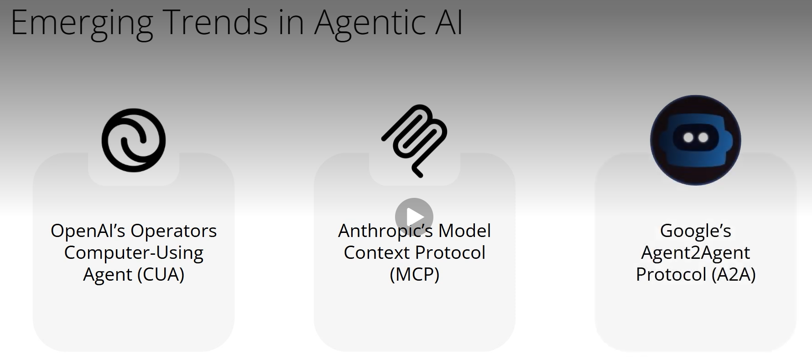
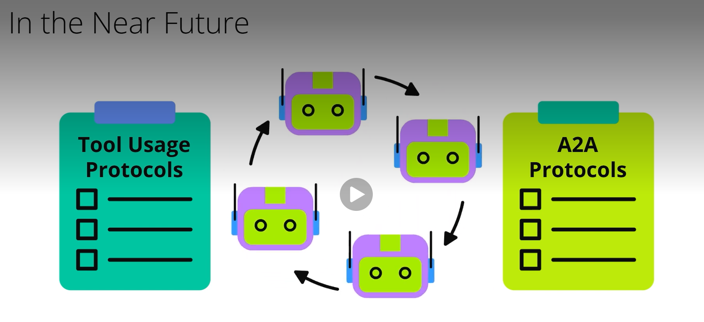
### In summary:

- Tools turn agents from passive responders into active problem-solvers.
- Function Calling connects language models to actions.
- Standardized protocols are paving the way for coordinated, multi-agent systems.
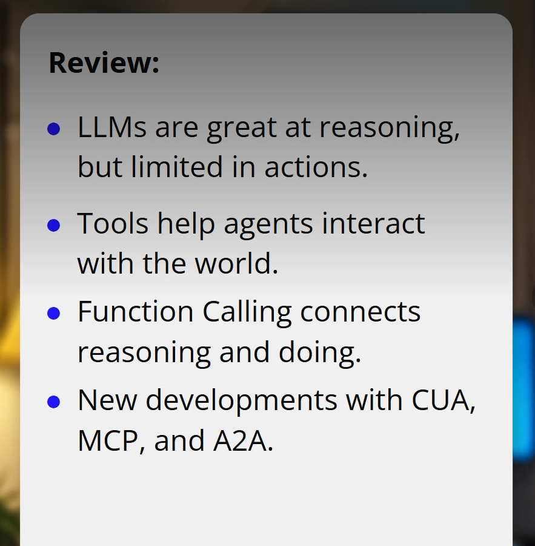