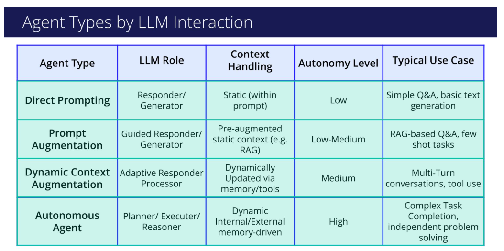

# Agent Types

## Agent Types and Their Role in Workflows
### We've established that agents are the core components that bring intelligence to our workflows. However, not all agents are built the same, and not all workflows have the same requirements. The way an agent interacts with its LLM "brain" directly determines its capabilities and, therefore, the complexity of the workflow it can support.
### It is helpful to think of these agent types as a spectrum of capabilities. On one end, we have simple, direct interactions suitable for straightforward, single-step workflows. As we move along the spectrum, the agents become more sophisticated, enabling more complex, adaptive, and multi-step agentic workflows.
- Direct Prompting Agents:
  - Description: This is the most basic agent type. It acts as a direct relay, sending a user's prompt to the LLM and returning the response without modification.
  - Role in a Workflow: This agent is best suited for simple, single-task workflows. For example, a workflow designed only to answer a user's question or generate text from a single instruction would use a Direct Prompting Agent.
- Prompt Augmentation Agents:
  - Description: This agent enhances the prompt before sending it to the LLM. It "augments" the user's input with additional context, such as a predefined persona, few-shot examples, or retrieved documents.
  - Role in a Workflow: This type allows us to create specialized steps within a workflow. A workflow could employ a "Financial Analyst" agent that uses specific financial data to augment its prompts, ensuring its outputs are contextually relevant and distinct from, for instance, a "Creative Writer" agent in the same workflow.
- Dynamic Context Augmentation Agents:
  - Description: This is a more advanced agent that can adapt during an interaction. It uses tools (like a web search or API call) and memory to update the LLM's context in real-time.
  - Role in a Workflow: This agent is the key to building dynamic, multi-step workflows. A workflow step powered by this agent can perform an action (e.g., search for real-time stock prices), process the result, and use that new information to inform the very next action (e.g., make a trade recommendation), all within a single, continuous process.
- Autonomous Agents:
  - Description: At the most advanced end of the spectrum, these agents leverage the LLM for complex planning, decision-making, and multi-step execution with minimal human intervention.
  - Role in a Workflow: These agents act as the orchestrators or primary executors of the most sophisticated agentic workflows. An autonomous agent can take a high-level goal, independently create a plan of sub-tasks, execute that plan using various tools, and even self-correct if it encounters errors, driving the entire workflow from start to finish.
