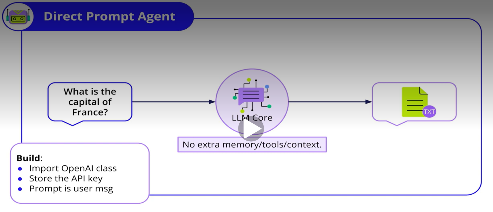
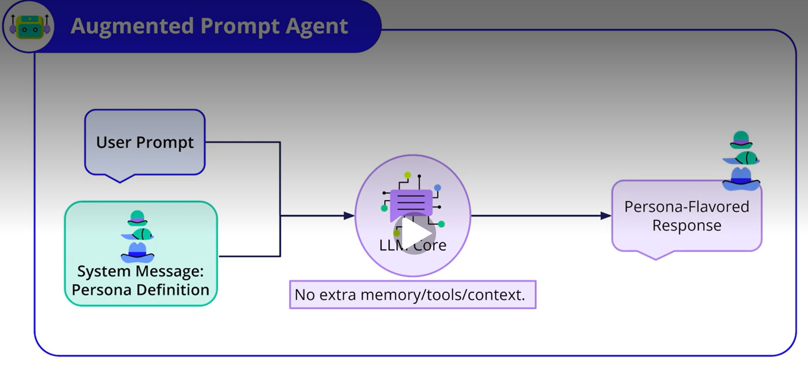
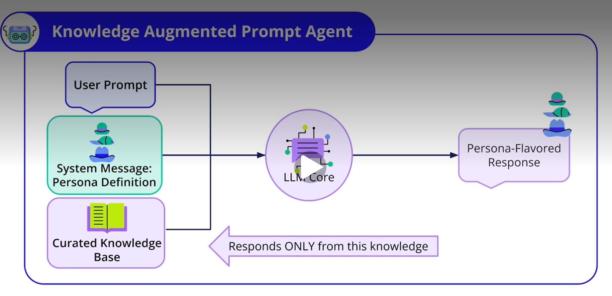
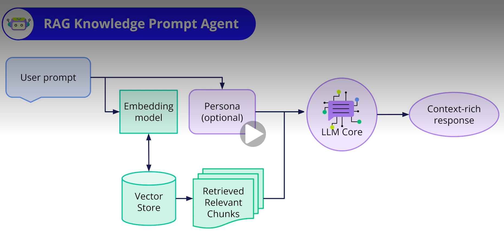
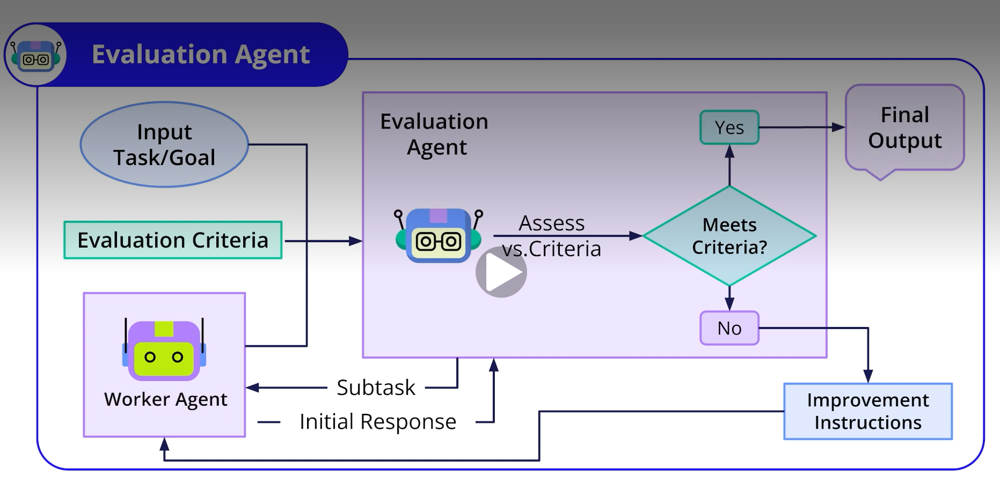
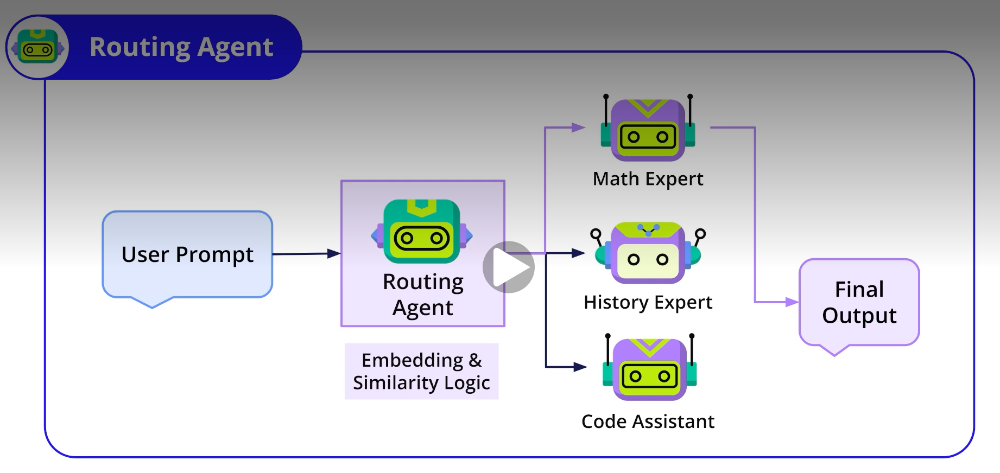
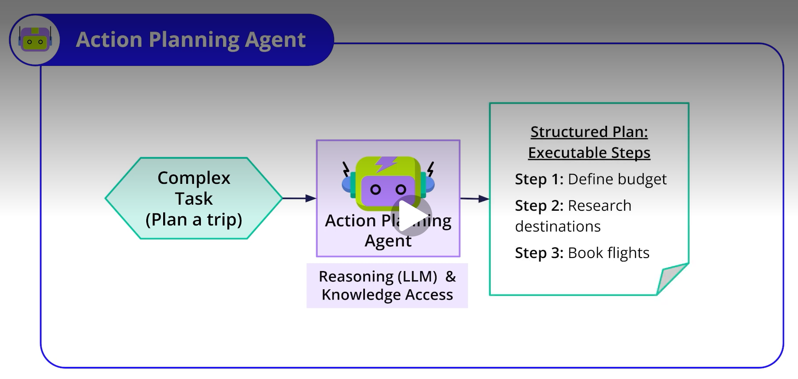

# Agent Types
### Not all agents are created equal. They exist on a spectrum of complexity and autonomy, largely defined by how they interact with their LLM core.
- **Direct Prompting**: The simplest form, sending a prompt directly to the LLM.
- **Augmented Prompting**: Adds a system message to define a persona.
- **Dynamic Context Augmentation**: Adapts during an interaction by using memory and tools to update context.
- **Autonomous Agent**: The most advanced type, leveraging the LLM for complex planning and execution.
## Common Types of Agents as Building Blocks
### As we start modeling, it's useful to know some common "types" of agents we might use. These are like the different specialists on our AI team. (This isn't an exhaustive list, but a good starting point!)
- **Direct Prompt Agent**: The simplest; sends a user's query directly to an LLM.

- **Augmented Prompt Agent**: Adds a persona or system instructions to the LLM call to shape the response.

- **Knowledge Augmented Prompt Agent**: Uses a defined persona AND a specific, curated knowledge base to answer, ignoring the LLM's general knowledge.
![]
- **RAG Knowledge Prompt Agent (Retrieval-Augmented Generation)**: Dynamically retrieves relevant information from a large dataset before answering, making it flexible and less prone to making things up.

- **Evaluation Agent**: Acts as a quality controller, assessing the output of other agents against criteria and potentially prompting revisions.

- **Routing Agent**: The "project manager" that directs incoming tasks to the most suitable specialized agent.

- **Action Planning Agent**: Takes a complex goal and breaks it down into a sequence of smaller, executable steps.
