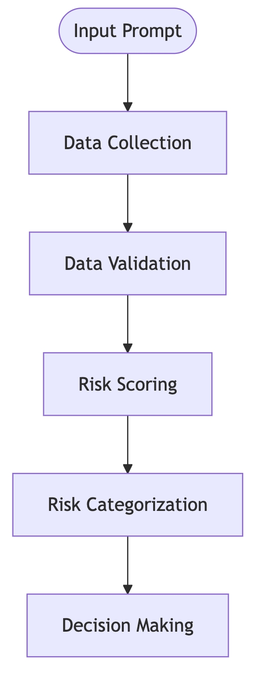
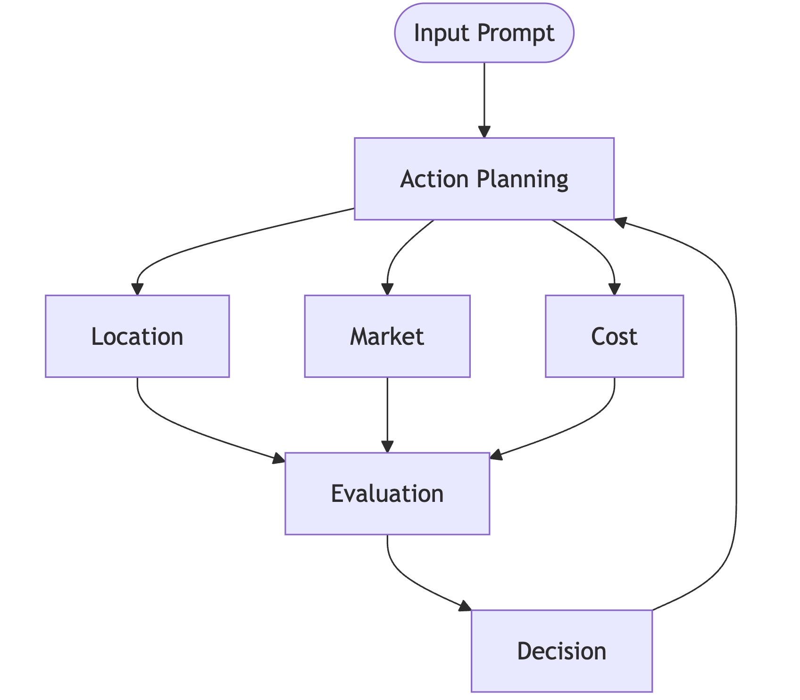

# Implementing Agentic Workflow Modeling
### A deterministic workflow for plant maintenance is linear and rigid. Each step follows the last in a predefined sequence, from checking a schedule to inspecting a pump and logging issues. It cannot adapt to new situations.
```
flowchart TD
        Start([Start Maintenance Process]) --> CheckSchedule[Check Maintenance Schedule]
        CheckSchedule --> InspectPump[Inspect Pump Physically]
        InspectPump --> LogIssues[Log Observed Issues]
        LogIssues --> Diagnose[Diagnose Problem]
        ...
        NotifySupervisor --> End([End Process])
```
### An agentic workflow, conversely, is built around agents. It might start with a Task Decomposition Agent that breaks down the goal, a Router Agent that sends subtasks to specialized Knowledge Agents (like a Pump Info Agent or a Visual Inspection Agent), and an Evaluator Agent that assesses the results. This model is dynamic and goal-driven, not script-driven.
```
flowchart TD
        Start([Start Agentic Workflow]) --> Decomposer[Task Decomposition Agent]
        Decomposer --> Router[Router Agent]

        subgraph "Knowledge Agents"
            A[Pump Info Agent\nTool: Fetch Pump History]
            B[Visual Inspection Agent\nTool: Camera/Report Parser]
            C[Diagnostics Agent\nTool: Sensor Data Analysis]
            D[Work Order Agent\nTool: Create/Track Orders]
        end

        Router --> A & B & C
        A & B & C --> Evaluator[Evaluator Agent]
        Evaluator -->|Fix Needed| D
        D --> Evaluator
        Evaluator -->|OK| End([Finish])
```
## Diagram 1: Deterministic Workflow

- This first diagram, with its straight, unbranching path from "Input Prompt" through "Data Collection," "Data Validation," "Risk Scoring," "Risk Categorization," and finally to "Decision Making," is a visual representation of a deterministic, rule-based workflow.
- This traditional approach follows a fixed, sequential logic. This diagram shows exactly that – each step must happen in order, one after the other. There's no skipping ahead or tasks happening at the same time.
- This is process-centric modeling. The focus is entirely on the sequence of defined steps (the process itself) rather than on individual actors or agents with specialized skills.
- If you feed this workflow an input prompt, it will always attempt to go through these exact stages in this exact order.
- Think of this as that "enormous, sprawling flowchart that details every single if-then-else"
## The "Team of Specialists" – The Agentic Workflow:
- Next, we'll tackle the much larger question – "Should we build a new factory?" – using a modular, agent-based system.
- Instead of one long process, you'll see a system composed of distinct agents, each with a specialized function: a Task Decomposition Agent to break down the problem (sound like our "Action Planning Agent"?), Knowledge Gathering Agents (Location, Cost, Market, Risk specialists), a Routing Agent to manage their work, an Evaluation Agent to synthesize their findings, and finally a Decision Agent. This is precisely the agent-centric thinking we discussed
- **Modeling with Agent Capabilities**: Each agent is defined by what it can do. The Location Agent understands infrastructure; the Evaluation Agent knows how to model scenarios. This focus on capabilities is key to designing flexible agentic systems.
- **Orchestrated Flow**: Even though it's "agentic," notice the description mentions "deterministic logic" for the overall flow. This is an important point: agentic systems aren't necessarily chaotic; they are often carefully orchestrated systems of interacting components, where each component might itself be quite predictable.
## Focus on:
- The structural differences between the two workflow models.
- How the problem is broken down in the agentic approach versus the deterministic one.
- The roles and responsibilities of each named agent in the agentic system.
- How the flowchart helps you understand the agentic workflow's design and potential for parallel processing or feedback loops.
- Think about how much harder it would be to change a core rule in the middle of the complex deterministic flowchart versus modifying or adding a specialized agent in the modular system.
