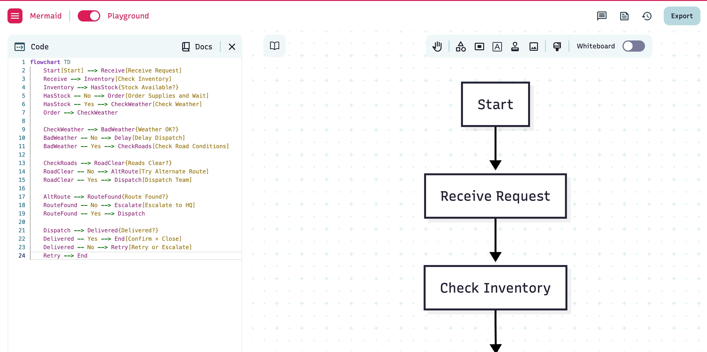

# Visual Notation with Mermaid Diagrams
[Visual Notation with Mermaid Diagrams](https://mermaid.ai/live/edit?utm_medium=editor_selection&utm_campaign=playground&utm_source=mermaid_js#pako:eNpFT0sOwiAUvIqZddNAERS2uvUChg2RZ2200CBN1KZ3F2uMuzdvfpkJp-gJBqjQps7D5DRShZ5S7z4Qkw2rlUW-UE8WppzepauFDXPxDC4cY-x_thTH9gJzdrd7QePgXaZ959rk_hIKntIujiHDyCUBZsIDplGiVkKxRm611A0v5LNIdK2lKE_NhZRsLeVc4bV0slptGFei2Ygt52LNRAXyXY7p8B21bJvf0QBD6g)
### Mermaid.js is a JavaScript-based tool that lets you create diagrams and charts from text using a syntax similar to Markdown. This means you can write simple, human-readable code to generate complex visuals like flowcharts, sequence diagrams, and Gantt charts.
- Instead of using a mouse to drag and drop shapes, you write text to define the diagram's structure and elements.
- Mermaid provides an online editor where you can write code and see the diagram update in real-time.
- **Variety of Diagram Types**: Mermaid supports a wide range of diagrams, including:
  - Flowcharts
  - Sequence diagrams
  - Class diagrams
  - State diagrams
  - Gantt charts
  - Pie charts
  - Entity-Relationship diagrams
  - User Journey diagrams
  - Git graphs
### We're using flowcharts to represent agentic workflows

### Here is a short tutorial on how to write the Mermaid.js notation. This will cover the fundamental building blocks you need to create your own diagrams.
## 1. Declaring the Flowchart
### Every flowchart begins by declaring its type and direction. In the course, flowchart TD is consistently used, which means "Top Down".
```
flowchart TD
    // Your diagram content goes here
```
- TD or TB - Top Down / Top to Bottom
- LR - Left to Right
## 2. Defining Nodes (The Shapes)
### Nodes are the shapes that represent steps, decisions, or agents in your workflow. You give each node a unique ID and then define its text and shape.
### **Syntax**: ID[Text]
- **Default (Rectangle)**: Used for tasks or steps.
```
CheckSchedule[Check Maintenance Schedule]
```
- **Stadium Shape (Start/End)**: Use ([Text])
```
Start([Start Maintenance Workflow])
```
- **Diamond (Decision)**: Use {Text}
```
HasStock{Stock Available?}
```
### Here’s a simple example combining these:
```
flowchart TD
    Start([Start Process]) --> TaskA[Perform a Task]
    TaskA --> Decision{Is it complete?}
```
## 3. Connecting Nodes (The Arrows)
### You connect nodes using arrows (-->). You can also add text to the arrows to represent choices like "Yes" or "No".
- Syntax: ID1 --> ID2 or ID1 -->|Link Text| ID2

- Simple Connection:
  - Start --> Decomposer
- Connection with Text:
  - DispatchDecision -- Yes --> DispatchAgent[DispatchAgent]
  - Evaluator -->|Fix Needed| D
### Example:
```
flowchart TD
    Start([Start]) --> Check{Is inventory low?}
    Check -->|Yes| CreateOrder[Create Reorder Order]
    Check -->|No| Audit[Periodic Inventory Audit]
```
## 4. Grouping Nodes (Subgraphs)
### Subgraphs are perfect for organizing related agents or tasks visually, as seen in the more complex agentic workflow diagrams.
### **Syntax**:
```
subgraph "Group Name"
    Node1[Text]
    Node2[Text]
end
```
### Example:
```
flowchart TD
    subgraph "Knowledge Agents"
        A[Pump Info Agent\nTool: Fetch Pump History]
        B[Visual Inspection Agent\nTool: Camera/Report Parser]
        C[Diagnostics Agent\nTool: Sensor Data Analysis]
    end
```
## 5. Styling Nodes and Arrows
### Mermaid allows you to customize the appearance of nodes and arrows using CSS-like syntax. You can

```
flowchart TD
    Start[Start] --> Receive[Receive Request]
    Receive --> Inventory[Check Inventory]
    Inventory --> HasStock{Stock Available?}
    HasStock -- No --> Order[Order Supplies and Wait]
    HasStock -- Yes --> CheckWeather[Check Weather]
    Order --> CheckWeather

    CheckWeather --> BadWeather{Weather OK?}
    BadWeather -- No --> Delay[Delay Dispatch]
    BadWeather -- Yes --> CheckRoads[Check Road Conditions]

    CheckRoads --> RoadClear{Roads Clear?}
    RoadClear -- No --> AltRoute[Try Alternate Route]
    RoadClear -- Yes --> Dispatch[Dispatch Team]

    AltRoute --> RouteFound{Route Found?}
    RouteFound -- No --> Escalate[Escalate to HQ]
    RouteFound -- Yes --> Dispatch

    Dispatch --> Delivered{Delivered?}
    Delivered -- Yes --> End[Confirm + Close]
    Delivered -- No --> Retry[Retry or Escalate]
    Retry --> End
```