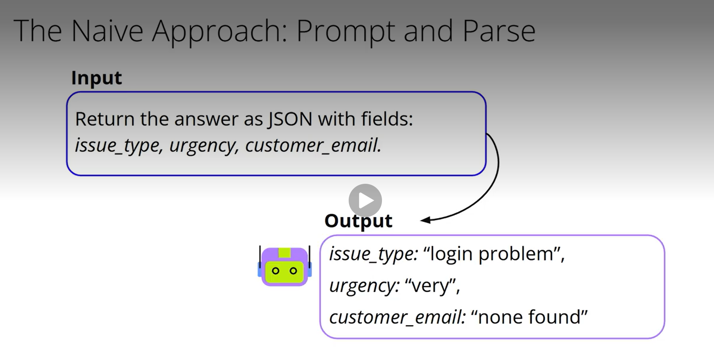
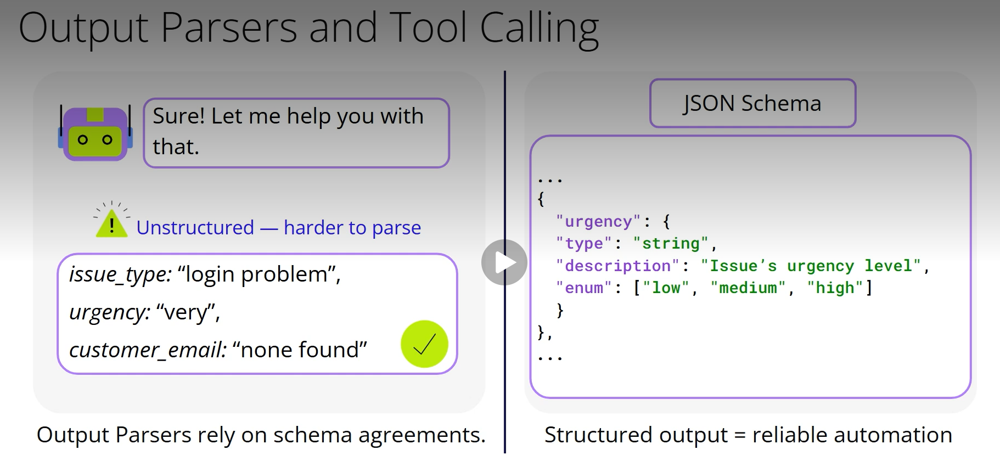
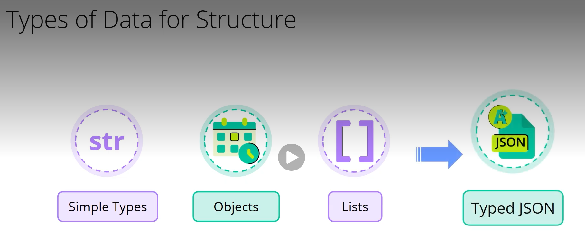
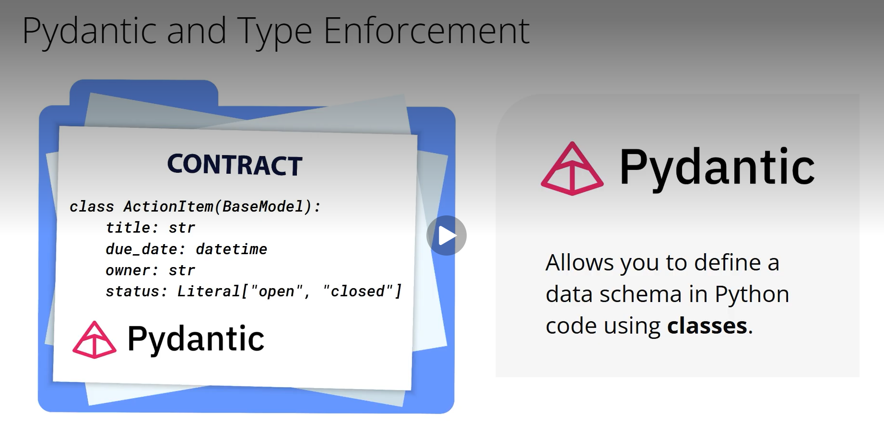
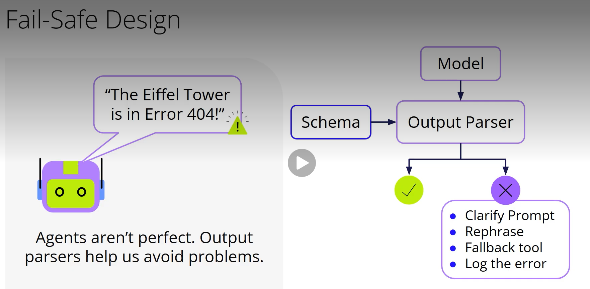

# Structured Outputs

## Structured Outputs: Making AI Responses Actionable
### Agents are more powerful when they return structured, machine-readable outputs like JSON instead of just plain text. Structured responses allow agents to integrate with other systems, power automation, and trigger actions in workflows. For example, rather than summarizing a customer call in text, an agent can extract structured fields like:
```json
{
  "issue_type": "login_problem",
  "urgency": "high",
  "customer_email": "jane@mail.com"
}
```
### This format can be directly used in ticketing systems, dashboards, or alerts. Free-form text may be readable, but structured data is what enables downstream tools to act.

## Why Prompting Isn’t Enough
### A common early method was to prompt the model to output JSON, such as: “Return the answer as JSON with fields: issue_type, urgency, customer_email.” While this sometimes works, models often return vague or invalid data, like "urgency": "very" or "email": "none found", which causes errors when code tries to use it. LLMs are trained for natural language, not strict type rules.


## Output Parsers and Function Calling
### To improve reliability, output parsers can validate whether the model's response conforms to a defined schema. If valid, the output is parsed; if not, fallback strategies can be applied.
### Function calling provides an even more robust solution. Here, the model is given a JSON schema and asked to call a specific function. The model must output a structured function call object that matches the schema. This guarantees correct format and types, turning the model into something more predictable and usable in software systems.

## Modeling Complex Data with Pydantic
### When dealing with more complex outputs—like lists of tasks or nested objects—typed JSON becomes essential. Python’s Pydantic library enables schema enforcement through class definitions. For example:
```python
class ActionItem(BaseModel):
  title: str
  due_date: datetime
  owner: str
  status: Literal["open", "closed"]
```



### This ensures that agents generate only valid outputs. If the model's response fails validation, the system can retry, rephrase the request, or handle the error safely.

## Designing for Reliability
### Agents aren’t perfect and may return malformed data. Structured output mechanisms help catch and manage these errors. Using output parsers, schemas, and retry logic builds resilience into AI systems.

### Structured outputs are foundational for agents that do more than talk. They enable integration, automation, and reliability—turning language models into powerful components of real-world workflows.