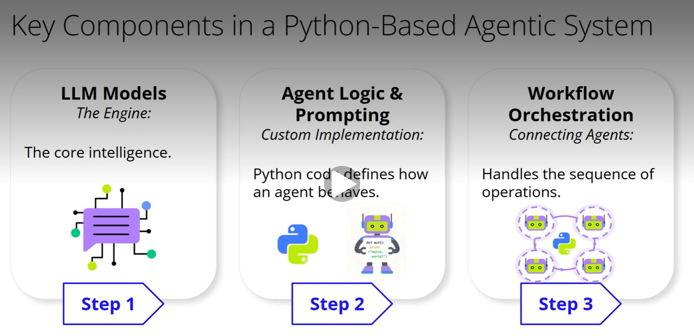
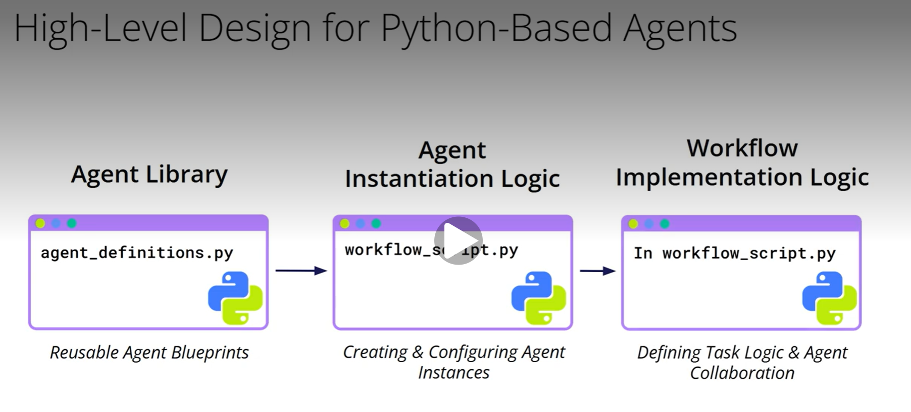

# Introduction to Implementing Agentic Workflows with Python
## Implementing an Agentic Workflow in Python
### Welcome! Having explored the concepts behind AI agents and agentic workflows, it's natural to ask: how can one actually build these intelligent agents in practice? We'll look at establishing coding foundations and setting up basic structures for individual agents. The goal is to understand how foundational agent components can be constructed using Python. Think of this as examining the creation of versatile building blocks.
### There are different paths you can take:
- A common approach involves using existing agent frameworks, which offer many pre-built components and abstractions.
- Another path is to build the core logic more from scratch, perhaps using Python and a preferred LLM model directly.
### This latter approach, while potentially more intensive, offers deep insights and maximum control over the process, allowing you to see exactly how agents can work together. The choice of approach often depends on the project's goals, timelines, and the desired level of customization and understanding. Learning the 'from scratch' principles can be helpful for understanding what's happening inside more complex tools
## Constructing agentic systems using Python
### Building dependable systems usually involves several major components, with a focus on crafting the core logic.
1. **LLM Models - The Engine**: Central to any agent is its access to Large Language Models. These are the engines providing the core intelligence. A flexible system design might allow for different LLMs to be connected or swapped, making sure of adaptability as new models emerge.
2. **Agent Logic & Prompting - Custom Implementation**: An important layer is the 'agent logic' itself. This is where Python code would define how an agent behaves. This includes crafting effective prompts to communicate with LLMs and implementing the distinct capabilities envisioned for different types of agents.
3. **Workflow Orchestration - Connecting Agents**: With individual agents defined, a system needs to manage how they work together. 'Workflow orchestration' logic, also implemented in Python, would handle the sequence of operations, the flow of information between agents, and the overall execution of multi-agent processes. While various tools can provide these pieces, understanding how to conceptually structure these components in Python offers deep insight into their functionality.

