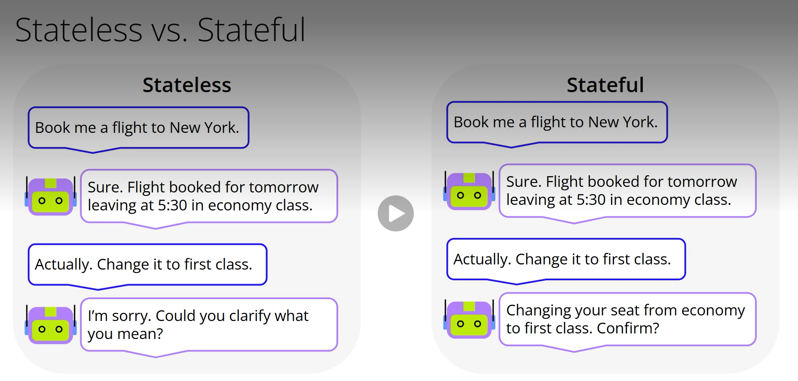
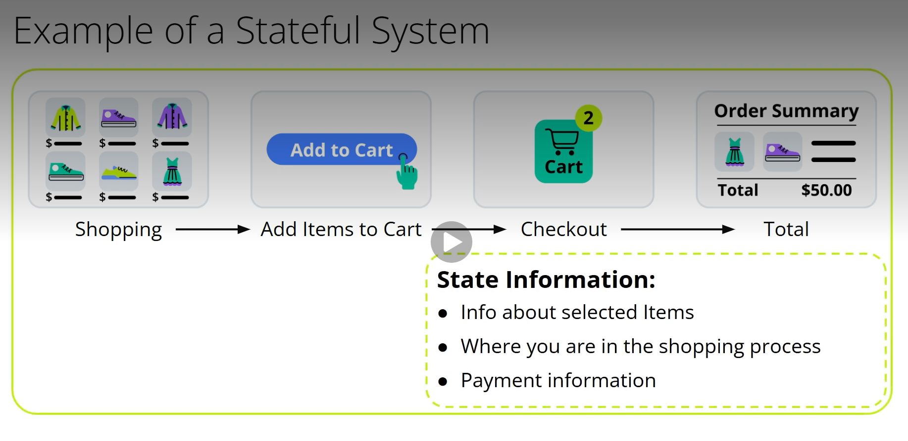
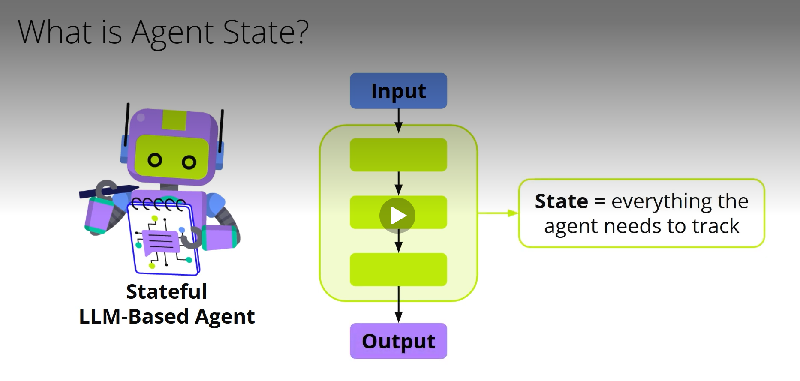
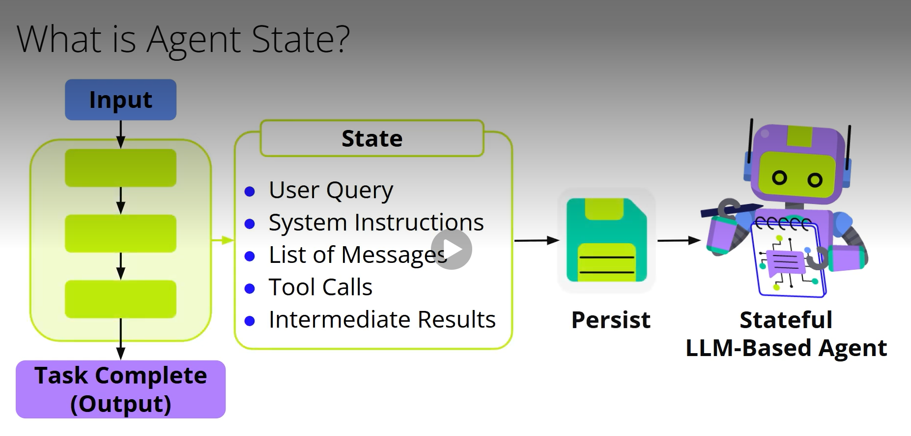
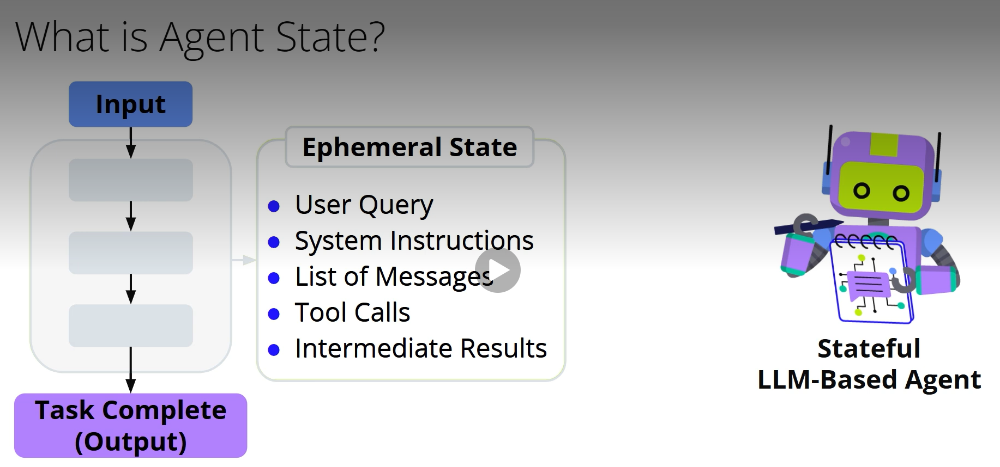
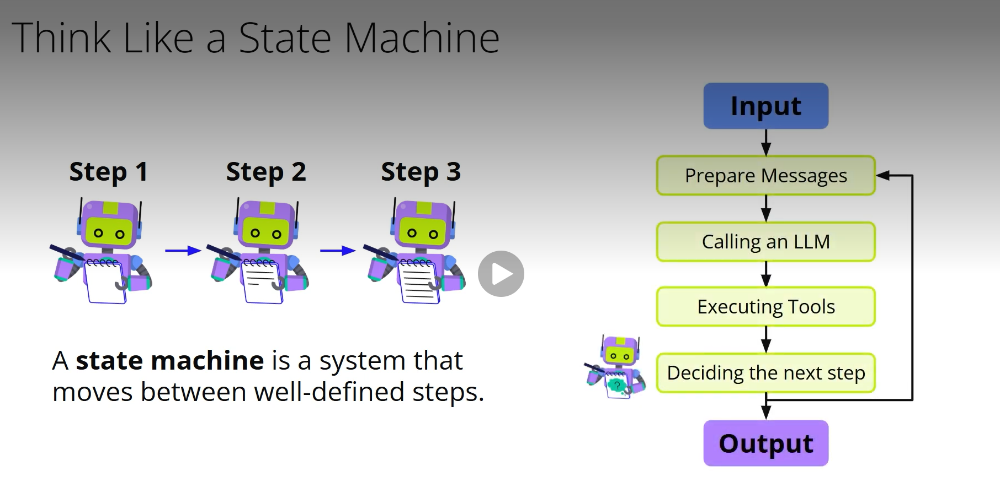
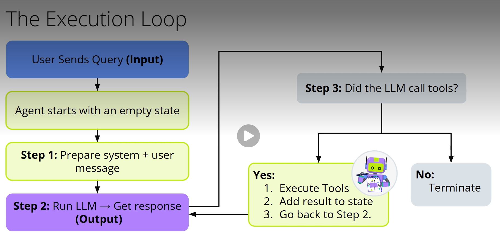
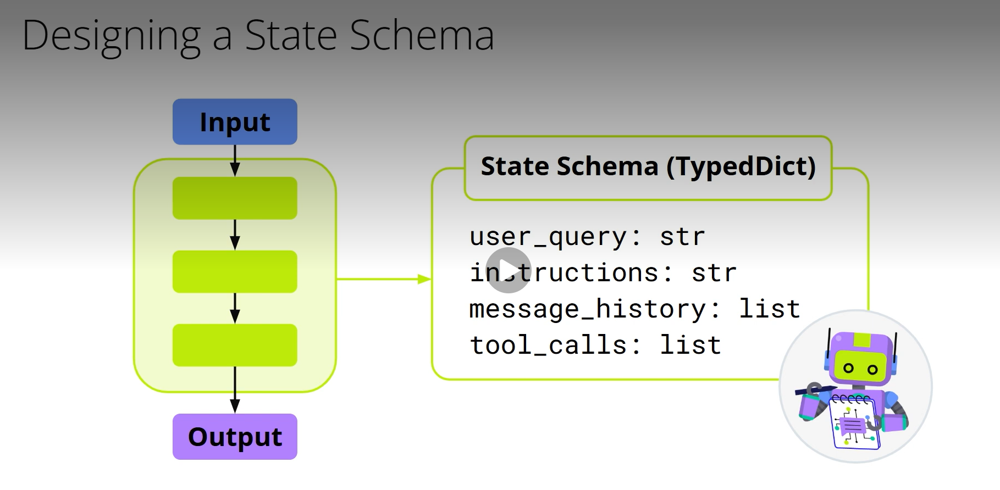
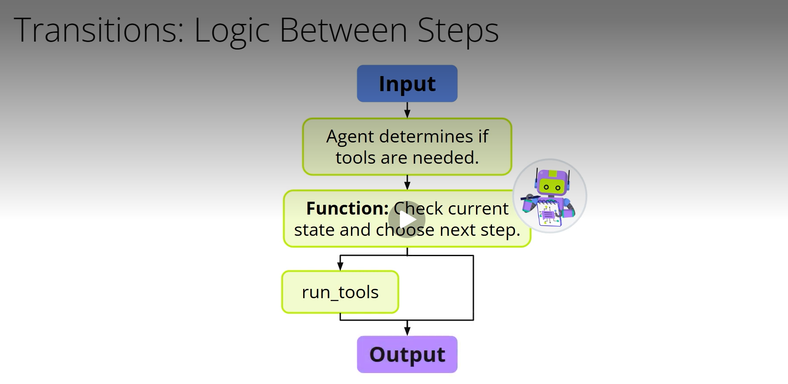

# Agent State

## Managing Agent State with State Machines
### LLMs are stateless by default—each interaction is isolated, with no memory of prior prompts. But intelligent agents often need context to manage complex tasks. This requires state: a representation of what the agent knows and is doing during a task.

## Stateless vs. Stateful Systems
### In a stateless system, every prompt is treated independently. LLMs work this way unless given context in the input. In contrast, a stateful system tracks what has already happened, like the items in an online shopping cart. This ability to retain context is essential for agents that take multiple steps or interact with tools across time.

## What Is Agent State?

### For LLM-based agents, the state includes:
- The original user input
- System instructions
- A message history
- Any tool calls made or pending
- Intermediate results from prior steps

### This state is ephemeral—it only exists while the task is running, unless explicitly saved. It functions like working memory, tracking progress and context throughout the execution.

## Using State Machines to Manage Execution

### Agents can be modeled as state machines. A state machine transitions through defined steps, updating the internal state at each one. For example, steps may include:
- Preparing the prompt
- Calling the LLM
- Checking for tool use
- Executing tools
- Deciding what to do next
### Each step receives the current state, processes it, and returns an updated version. Transitions between steps depend on the contents of the state—this makes the workflow conditional and adaptable.

## The Execution Loop

### The agent's process typically follows a loop:
1. Receive user query → start with an empty state
2. Step 1: Prepare system and user messages
3. Step 2: Run LLM to generate a response
4. Step 3: If tools are requested:
   - Execute tools
   - Update the state with results
   - Repeat step 2
5. Step 4: If no tools are needed → end the task
### This loop builds a structured execution flow, where the agent reasons, acts, and refines its output through multiple steps.

## Defining the State Schema

### A type system like Python’s TypedDict can define the agent's state structure. Fields might include:
- query: the user input
- instructions: system guidance
- messages: chat history
- tool_calls: pending or completed tool interactions
### Each function in the agent’s logic receives and returns an object matching this schema, ensuring consistency across steps.

## Conditional Transitions

### Transitions between steps are dynamic. For instance, the agent should only move to a tool execution step if tools were selected. Transition functions examine the current state and decide which step to take next, often updating the state along the way.

## Summary
- LLMs are stateless, but agents require state to handle complex workflows
- A state machine offers a modular way to manage that state
- The state includes the agent’s instructions, messages, tool use, and intermediate results
- Execution state is temporary, like working memory, and is cleared when the task ends
- Structuring agents as state machines makes them more predictable, testable, and reliable
