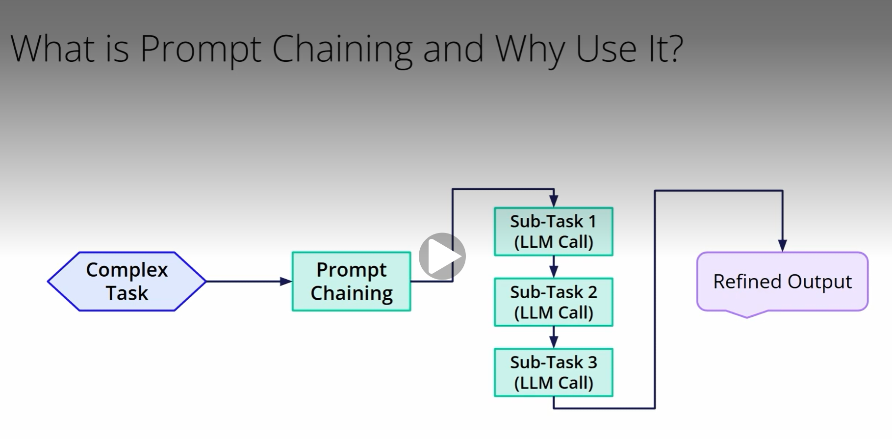
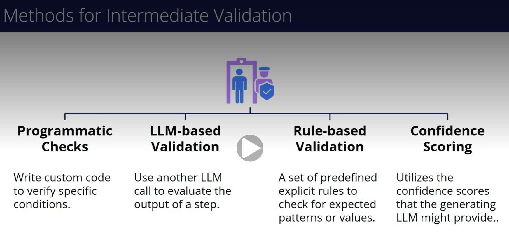
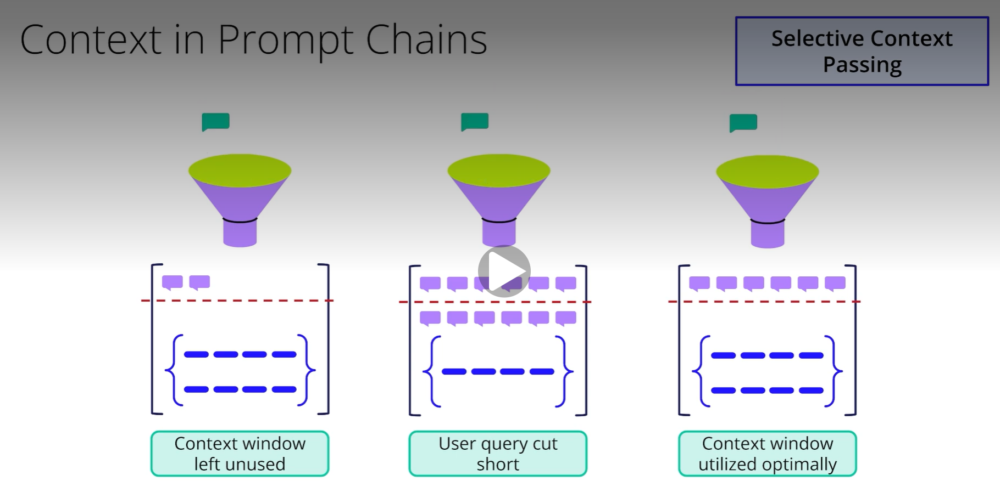

# Introduction to Prompt Chaining Workflow
# Agentic Workflow Patterns: Prompt Chaining Workflow
### Let's explore a powerful agentic workflow pattern: Prompt Chaining. Get ready to learn how to break down complex tasks into manageable steps for Large Language Models, leading to more accurate and reliable outcomes.
## So, what exactly is Prompt Chaining?
### Imagine you have a large, complex task. Trying to get an LLM to solve it in one go can be tricky. Prompt chaining is a technique where we decompose this complex task into a sequence of smaller, more manageable steps. Each step typically involves an LLM call, where the output of one call serves as the input for the next. Why is this useful? By breaking down the problem, we make each individual LLM call simpler.
### Prompt chaining is all about task decomposition. Think of it like an assembly line in a factory. Instead of one person trying to build an entire car from scratch, the process is broken down into a series of specialized stations, each performing a specific task.
### Similarly, with prompt chaining, we divide a large problem into simpler subtasks. Each LLM call in the chain is like a specialized worker; it only needs to focus on its specific subtask, using the output from the previous 'worker.' This leads to enhanced reasoning across multiple steps and can even reduce LLM 'hallucinations' by keeping the model focused.
### While prompt chaining is powerful, it has an inherent challenge. A key characteristic of this pattern is that the output of one LLM call directly informs the input of the next. This creates a dependency chain.
- What happens if an early step in the chain produces a flawed or incomplete output? Unfortunately, this error can propagate and even compound through subsequent steps. Imagine a small mistake in the first calculation of a multi-step financial report. That mistake will carry through, potentially making all following calculations incorrect and ultimately derailing the entire workflow. This risk of error propagation is considerable and highlights an important need we must address
### So, how do we combat error propagation? The answer lies in Intermediate Validation. This involves systematically checking the accuracy, relevance, and format of the output from each prompt in the sequence before it's passed to the next step. Think of these validation points as 'quality control gates' in our assembly line. Their purpose is to make sure that the intermediate outputs are aligned with what we expect and need for the workflow to succeed. By catching errors early, we prevent them from moving down the chain and being amplified.

