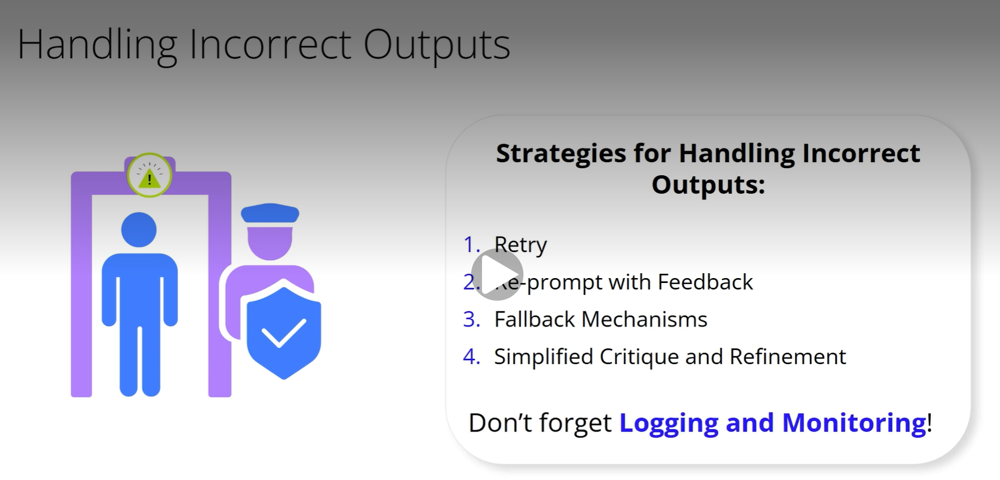

# Prompt Chaining Strategies
### We know we need validation. But how do we actually perform it? There are several distinct approaches, though some may use common implementation techniques:
- **Programmatic Checks**: Here, you write custom code to directly verify specific conditions. For example, checking if an output is valid JSON, if a summary meets a length requirement, or if numerical data falls within an expected range. This is about applying explicit, coded logic.
- **LLM-based Validation**: This approach uses another LLM call to evaluate the output of a previous step. This second LLM can assess more subtle qualities like factual accuracy, relevance to the prompt, or adherence to a specific tone – things that can be hard to codify explicitly.
- **Rule-based Validation**: With this method, you define a set of predefined, explicit rules to check for expected patterns or values. For instance, making sure a generated email contains a salutation and a closing. While these rules are often implemented programmatically, the focus here is on adherence to a specific, declared ruleset.
- **Confidence Scoring**: This method uses the confidence scores that the generating LLM itself might provide for its outputs. These scores are then typically checked programmatically against a set threshold to gauge validity. Outputs below a certain confidence might trigger corrective action. Choosing the right method, or combination of methods, depends on the specific needs of each step in your chain.
### So, your validation gate has flagged an incorrect intermediate output. What now? Simply stopping isn't always the best option. We need strategies to handle these situations:
1. **Retry**: The simplest approach. Just re-run the problematic prompt. This might work for transient LLM issues.
2. **Re-prompt with Feedback**: If validation gives specific reasons for failure (e.g., 'summary too long'), incorporate this feedback into a revised prompt. Ask the LLM to regenerate, taking the critique into account. This is key for iterative refinement.
3. **Fallback Mechanisms**: If retries fail, you might terminate the chain and log an error, or route to an alternative, perhaps simpler, task or a pre-defined 'safe' output.
4. **Simplified Critique and Refinement**: An LLM can be prompted to critique its own previous output based on given criteria. Then, another prompt instructs it to refine the output based on that critique. Don't forget Logging and Monitoring! Comprehensive logs of inputs, outputs, and validation results at each step are very important for debugging and understanding where and why a chain might be failing.
### Effective management of context is also important in prompt chaining. While each step needs enough information from previous outputs, overloading an LLM with excessive or irrelevant context can degrade performance or exceed context window limits. It’s a balancing act. We need Selective Context Passing: Only the most relevant parts of previous outputs should be passed as context. Plan what information each step truly needs. Prompt chaining itself helps manage finite context limits by distributing information across prompts. Sometimes, to prevent the LLM from 'forgetting' important earlier details, it's useful to use Contextual Reiteration – restating important context within each new prompt. The goal is to provide precisely the necessary and sufficient context for each step, making sure the LLM stays focused and performs effectively.
