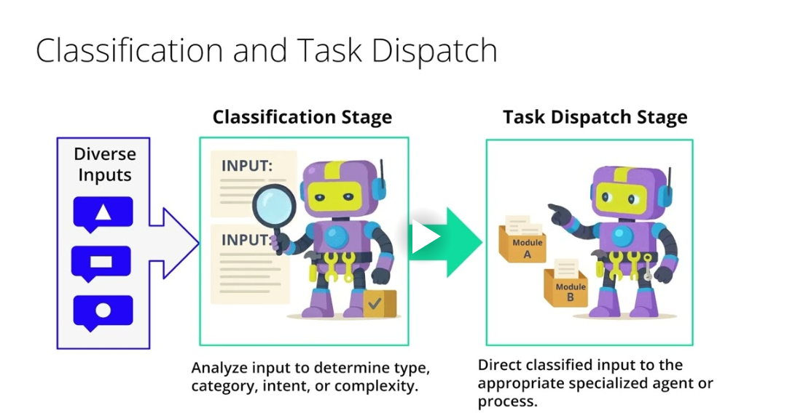

# Agentic Workflow Patterns: Routing

# Agentic Workflow Patterns: Routing
### Imagine you have a complex project with many different kinds of tasks. Some are simple, some require deep expertise, and others need specific tools. How do you make sure each task goes to the right place or person efficiently?
### This is where the 'Routing' pattern in agentic workflows comes into play. This pattern is designed to intelligently direct incoming tasks or inputs – whether they're raw user requests or steps from a planning agent – to different processing paths or specialized agents based on the nature of the input itself.
### So, why is routing so beneficial in agentic systems? Think of it like a sophisticated mail sorting facility. Instead of one person trying to handle every type of mail, specialized systems and routes make sure each piece gets to its destination quickly and correctly. Routing offers several key advantages:
- It enables task specialization. By directing inputs to agents or prompts highly optimized for specific tasks, we achieve better performance and accuracy.
- Routing is a powerful tool for resource optimization. We can direct tasks to different LLMs based on complexity, cost, and latency requirements. Simpler tasks might use faster, cheaper models, while complex ones go to more powerful models.
- Routing provides flexibility and adaptability. The system can handle diverse types of requests by dynamically choosing the right path for each one.
- It also enhances scalability, as new specialized agents or processing paths can be added easily as needs evolve.
### At the heart of the routing pattern are two fundamental stages: Classification and Task Dispatch.
- Imagine you're managing customer support. First, you need to understand what each incoming query is about – is it a billing question, a technical issue, or a sales inquiry? That's Classification.
### Classification is the initial step where the system analyzes an incoming task or input to determine its type, category, intent, or even its complexity. The goal is to understand the nature of the input so an informed decision can be made about how to handle it.
### Once the input is classified, the next stage is Task Dispatch.
- Based on the classification, the workflow directs or 'dispatches' the input (and its classification label) to the appropriate specialized agent, a specific prompt chain, a function, or a dedicated processing module.
- This is like sending that customer query to the billing department, the tech support team, or the sales team. Together, these two stages make sure that tasks are not just processed, but are processed by the most suitable component in the system.