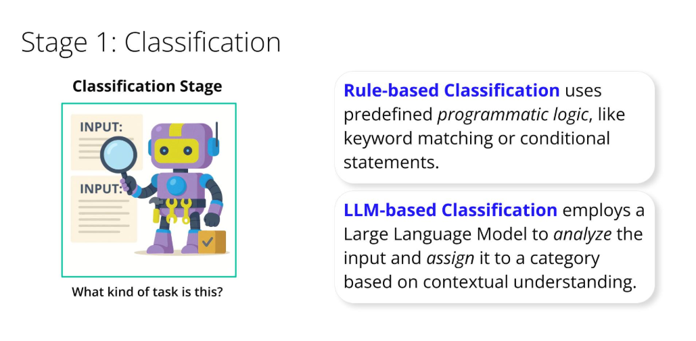

# Routing with Classification

### Let's focus on the first stage: Classification. The primary goal here is to accurately determine the nature of the incoming input. What is this task asking for? What category does it fall into? What is the user's underlying intent?
### Effective classification is key because the accuracy of the entire routing process depends on it. If a task is misclassified, it might be sent to the wrong agent, leading to inefficiency or incorrect results
### To perform this classification, systems can use various methods.
- **Rule-based classification** uses predefined programmatic logic, like keyword matching or conditional statements.
- **LLM-based classification** uses a Large Language Model to analyze the input and assign it to a category based on contextual understanding.
### The choice of method depends on factors like input complexity, desired accuracy, and performance needs. For now, the key is to understand that classification happens to prepare the input for the next stage.
### Once an input has been successfully classified, we move to the second core stage of routing: Task Dispatch. Task Dispatch is the process of taking the classified input and directing it to the most appropriate agent, system, or workflow designed to handle that specific category of task.
### This is where the actual 'routing' and branching logic comes into play. Think of it like this:
- The classification stage told us what the task is (e.g., 'Sales Inquiry').
- The task dispatch stage decides where it goes based on that classification (e.g., to the 'Sales Team Agent'). This implements branching: If the input is classified as 'Type A', it's dispatched down Path A to Worker Agent A. If classified as 'Type B', it's dispatched down Path B to Worker Agent B.
- The 'appropriateness' of a worker agent or processing path is determined by its designated expertise or capability, which aligns with the categories from the classification stage. This makes sure that each task is handled by the component best equipped for it, fulfilling the intelligent distribution aspect of routing.