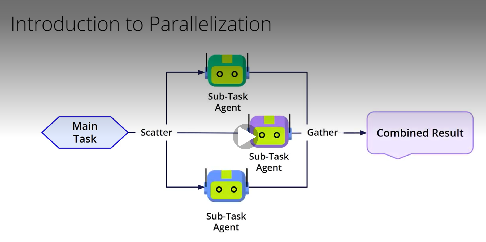
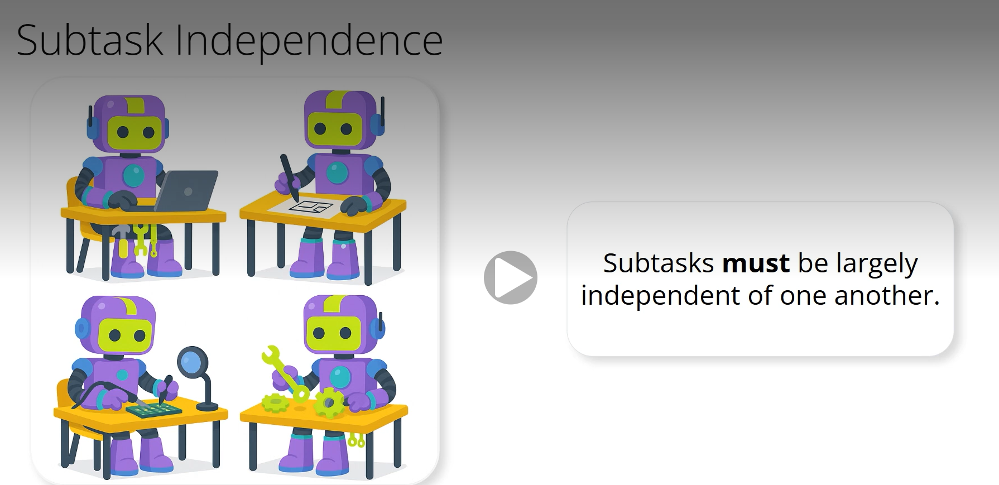
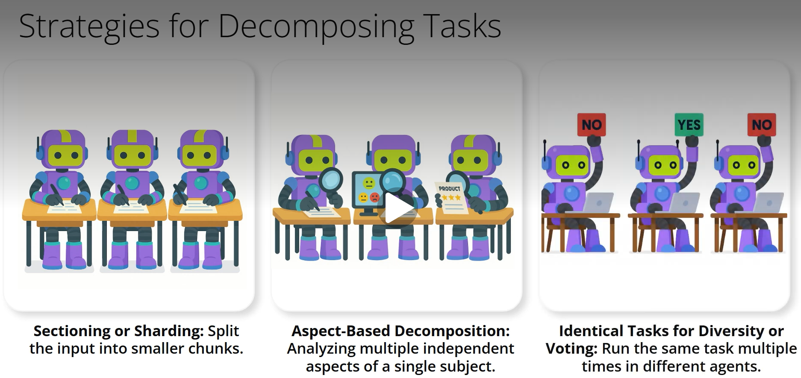
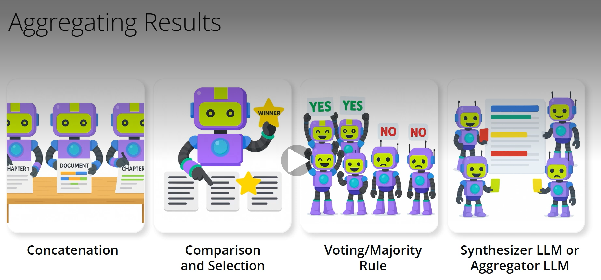
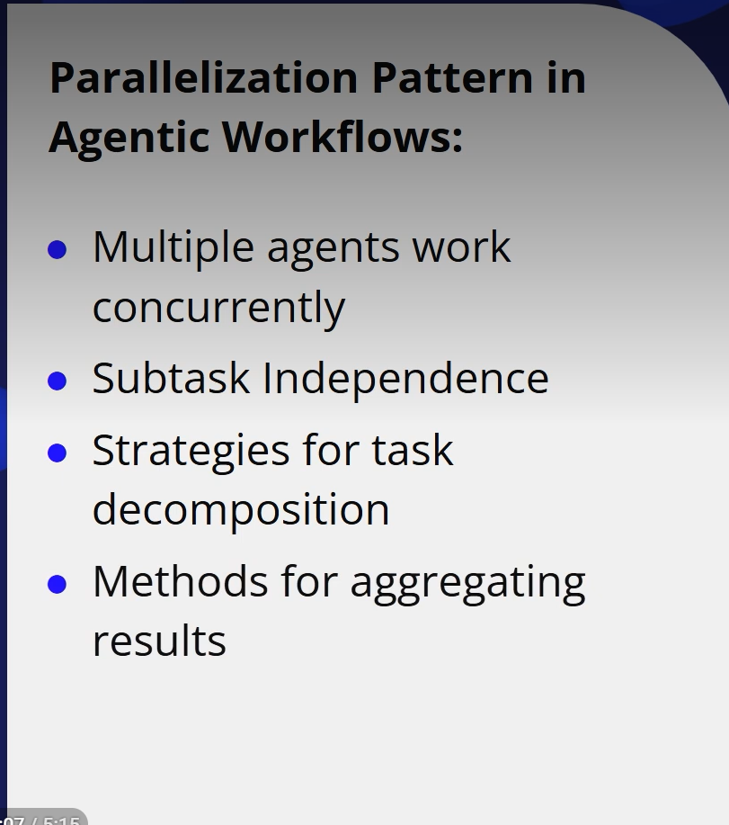

# Introduction to Parallel Workflows
# Agentic Workflow Patterns: Parallelization
### Ever felt like a complex task is taking forever? What if you could divide and conquer it, not just to save time, but also to get a better outcome? That's where the power of parallelization in agentic workflows comes in. This is a technique where multiple agents work on different parts of a task, or even the same task, at the same time.
### Think of parallelization like a team project. Instead of one person doing everything sequentially, you split the work among team members who can tackle their parts simultaneously.

### In agentic workflows, these 'team members' are AI agents. The idea is simple: distribute the workload, process in parallel, and then consolidate the results. This is much like the 'scatter-gather' pattern you might see in distributed computing, where a problem is 'scattered' to multiple workers and their individual findings are 'gathered'. This process generally involves a way to
- split the main task
- individual agents perform the sub-tasks
- a method to aggregate their outputs into a final, coherent result.

### And remember, it's not just about speed. By having multiple agents, we can also generate diverse perspectives or solutions, leading to potentially richer or more dependable outcomes.

### Before we jump into how to split tasks, there's a fundamental prerequisite, a golden rule for effective parallelization: subtasks must be largely independent of one another. What does this mean? It means that Agent A working on Subtask A shouldn't need to wait for Agent B to finish Subtask B to do its own work. If the output of one subtask is a direct input for another, then a sequential pattern, like prompt chaining, might be more suitable for those dependent parts.
