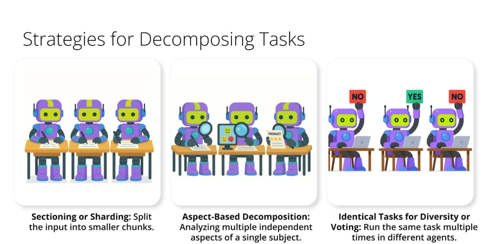

# Effective Parallelization

### Effective parallelization starts with smart task decomposition. Let's briefly cover some key strategies:
- **Sectioning or Sharding**: This is for large, divisible inputs. You split the input, like a long document or a large dataset, into smaller chunks, and each chunk is processed in parallel. For instance, each chapter of a book could be summarized by a different agent at the same time.
- **Aspect-Based Decomposition**: Use this when a task requires analyzing multiple independent aspects of a single subject. Different agents can concurrently investigate distinct facets – like one agent checking technical specs, another user sentiment, and a third competitor pricing for a product review.
- **Identical Tasks for Diversity or Voting**: Here, you run the same core task multiple times in parallel, perhaps with varied prompts or models. This is great for generating a range of creative outputs or for achieving a more reliable result by having multiple agents 'vote' on an answer, enhancing overall quality.
### Once parallel tasks are complete, we need to combine their outputs. Here are common aggregation strategies:
- **Concatenation**: This is the simplest – you just join the outputs from parallel tasks together, like appending individual chapter summaries to form a complete document.
- **Comparison and Selection**: If you've generated multiple solutions to the same problem in parallel, this method involves evaluating them based on predefined criteria and then selecting the 'best' one.
- **Voting/Majority Rule**: This is a powerful consensus mechanism. When multiple agents independently perform the same classification or answer a question, the most frequently occurring output is chosen as the final answer, boosting accuracy.
- **Synthesizer LLM or Aggregator LLM**: A dedicated LLM can take multiple, potentially diverse outputs from the parallel tasks and skillfully weave them into a single, coherent, and often more subtle final response.