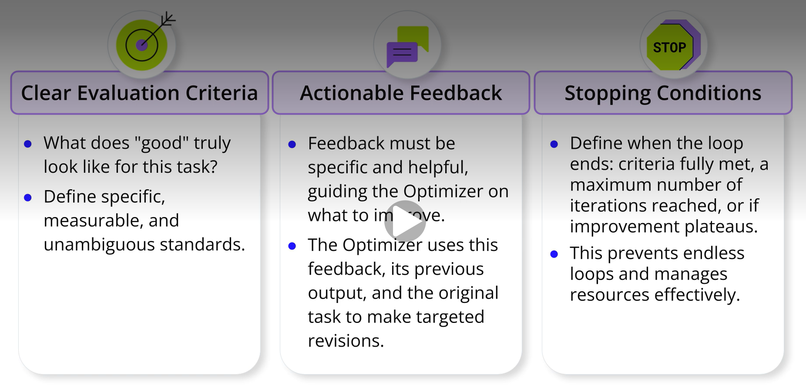

# Introduction to Evaluator-Optimizer Workflow
# Agentic Workflow Patterns: Evaluator-Optimizer Workflow
### Imagine you've tasked an AI agent with a task that requires a high-quality output, like drafting a comprehensive research report, generating critical software code, or creating a detailed marketing plan. The initial output is a good start, but how can you be absolutely sure it's accurate, complete, adheres to all constraints, and truly meets the high standards required? This is a common challenge in working with AI agents.
### We're going to explore a powerful agentic workflow pattern specifically designed to address this: the Evaluator-Optimizer workflow. You'll learn how this pattern uses an iterative cycle of generation, critique, and refinement to significantly improve the quality and reliability of outputs from AI agents.
### At its core, the evaluator-optimizer workflow has two key roles:
- **The Optimizer (or Generator) Agent**: This agent takes the initial task and generates an output. It also refines this output based on guidance it receives.
- **The Evaluator (or Critique/Reflector) Agent**: This agent acts like an expert reviewer. It assesses the Optimizer's output against predefined Evaluation Criteria – these are the standards for success. Based on this assessment, it provides specific, Actionable Feedback. This cycle – where the Optimizer generates, the Evaluator critiques against criteria, and the Optimizer refines based on that feedback – then iterates. With each loop, the output ideally gets closer to the desired quality.

