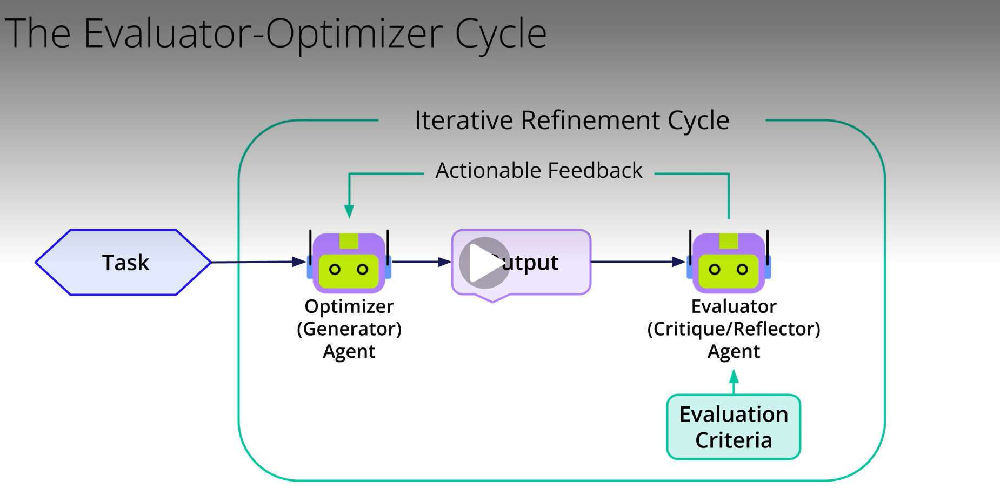

# Evaluator-Optimizer Loop

### To make the iterative loop effective, several elements are important:
- **Clear Evaluation Criteria**: You must precisely define what constitutes a successful output. Are your criteria specific? Can they be measured or objectively checked? Are they unambiguous? These criteria form the bedrock of the Evaluator's assessment and guide the entire refinement process.
- **Actionable Feedback**: The feedback provided by the Evaluator to the Optimizer is very important. It can't be vague like 'do better.' It needs to be specific, constructive, and provide enough detail for the Optimizer to understand what needs to change and ideally how to make that change. The Optimizer then uses this feedback, along with the original task instructions and its previous attempt, to generate an improved version.
- **Stopping Conditions**: An iterative loop needs a defined end. You must specify when the process should conclude. Common stopping conditions include:
  - the output finally meets all evaluation criteria
  - a predetermined maximum number of iterations has been reached
  - the improvement between cycles becomes negligible (diminishing returns). This makes sure the process is both effective and finite.
  - Getting these three elements right is key to using the full power of the Evaluator-Optimizer workflow.
### By establishing clear roles for an Optimizer to generate and refine, and an Evaluator to critique based on set standards, we create a cycle of continuous improvement.
### This iterative refinement approach is invaluable for tasks demanding high precision, adherence to complex requirements, and overall top-tier quality.