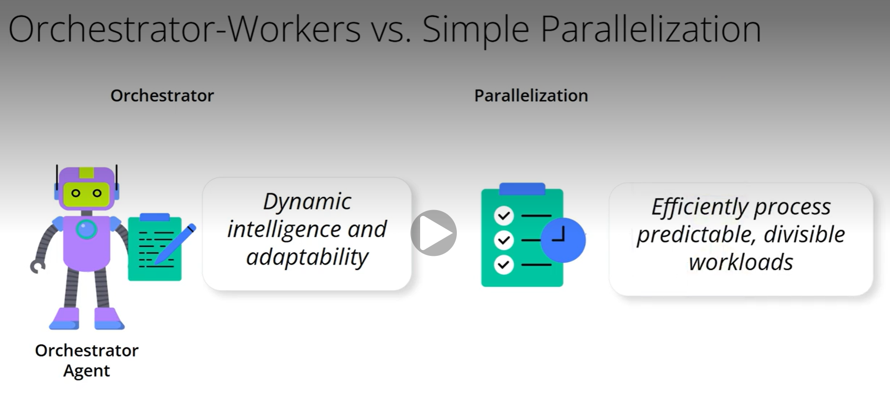

# Orchestrator-Workers vs Parallelization

### You might wonder how this sophisticated Orchestrator-Workers pattern differs from simply running tasks in parallel. The core distinction lies in its dynamic intelligence and flexibility.
- **Orchestrator-Workers**: This pattern is like having a smart project manager.
  - The Orchestrator analyzes the problem at runtime, dynamically decides on the necessary sub-tasks, and assigns them to the best-suited specialist workers.
  - It’s highly flexible and excels at tackling complex, unpredictable problems where the solution path isn't known in advance.
  - The orchestrator actively manages, delegates, and synthesizes information.
- **Simple Parallelization**: This is more akin to an assembly line.
  - Tasks are typically pre-defined, and the workflow is static – it breaks down a job into fixed, known parts that can be processed simultaneously.
  - It's very efficient for repetitive work that can be clearly divided into independent chunks, but it lacks the adaptability for novel or evolving requirements.
### Orchestrator-Workers brings dynamic intelligence and adaptability for challenges, while simpler parallelization is about efficiently processing predictable, divisible workloads.