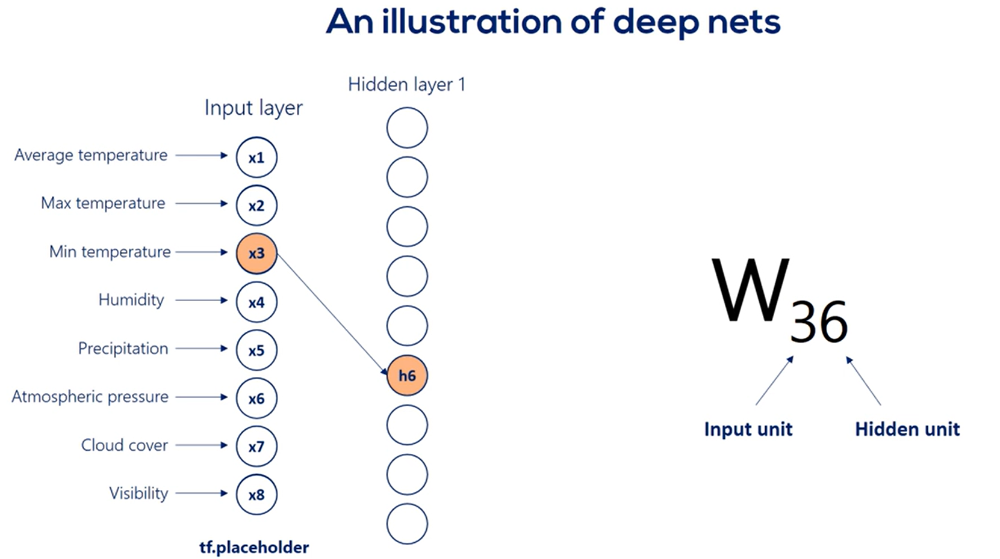
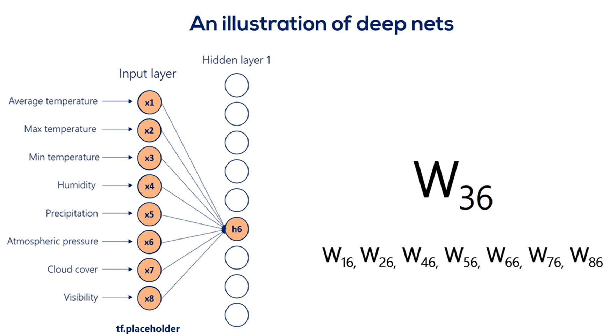

# dear_comrade_data_science_zero_to_hero
## Setup
### python -m venv venv
### venv\Scripts\Activate.ps1

## Deep Learning

### What is THE LAYER ?
#### A layer in a deep learning model is a structure or network topology in the model's architecture, which takes information from the previous layers and then passes it to the next layer.

#### Mixing liner combination and non non-linearities allows us to model arbitrary function
#### Functions with strange and un-conventional shapes
#### Model changes from inputs that are linearly combined, resulting in outputs to inputs that are linearly combined
#### and then go through some non-linear transformation resulting in outputs.

### What is DEEP NET ?
#### We take input and get output, and use this output to input to another layer, until we decide to stop, that we will compare with targets

####  All the layers between input and output are called hidden layers as we don't know what happens in between is hidden
#### Stacking the layers one after the other produces DEEP NET
#### Building blocks of hidden layers are called hidden units and hidden nodes
#### In mathematical terms if h is the tensor related to the hidden layer, each hidden unit is element of that tensor

#### Number of units(nodes) in the layer is often referred to as WIDTH of the layer
#### We always stack layers with same width

#### When we build model we decide width and depth, we refer these values as HYPER-PARAMETERS

#### Parameters are weight(W) and Bias(b)
#### Hyper-Parameters are width, depth, learning rate
#### Parameters are derived by optimizing model
#### Hyper-Parameters are set by developer
### Digging into DEEP NET 
#### Feed inputs and then combine these inputs linearly and then add non-linearity by using linear model
#### X*B (input (1 X 8),weights(8X9)) produces 1 X 9 matrics

#### Each arrow represents mathematical transformation of certain value
#### All the arrows takes us to  first hidden layer and certain weight is added and then non-linearity is applied

#### Applying non-linearity does not change shape of expression,it only changes linearity
#### Arrow represents weights not non-linearities 
#### How many weights can we have ?
#### Weights matrix is 8 X 9 so there are 8*9=72

#### 9 arrows goes out of input to hidden node
#### Each weight has two index numbers Wij (i= index of input unit,j=index of hidden unit)

#### Example W36 is applied to 3rd input X3 it is involved in calculation h6 hidden unit

#### Similarly weights W16,W26,W36,W46,W56,W66,W76,W86 all computing in 6th hidden unit
#### They are linearly combined then non-linearity added to produce 6th hidden unit

#### Same way we will get all other hidden units and 1st hidden layer is ready
#### This process continues combining linearities and adding non-linearity we produce new hidden layer
#### Until we decide what should be the output layer

#### As before, our optimization goal is finding values for weight matrices that would allow us to convert inputs into correct outputs as best as we can.
### Why do we need non-linearity after combining linearities

#### Non-Linearity is needed so we can break the linearity and represent more complicated relationships

#### Important consequence of including non-linearity is the ability to stack layers
#### Stacking layers is the process of placing one layer after another layer in meaningful way
#### We can't stack layers when we only have liner relationships 
#### The point we will make is that we cannot stack layers when we have only linear relationships.

#### Let's prove it. Imagine we have a single hidden layer and there are no non-linearities.
#### So, our picture looks this way.

#### There are eight input nodes,nine hidden nodes in the hidden layer and four output nodes.
#### Therefore, we have an 8 x 9 weights matrix for the linear relationship between the input layer and the hidden layer.
#### Let's call this matrix w1 and the hidden units h.
#### According to the linear model, h is equal to x times w1.

#### Let's ignore the biases for a while.So,our hidden units are summarized in the matrix h with a shape of one by nine.
#### Now, let's get to the output layer from the hidden layer.
#### Once again, according to the linear model, y is equal to h times w2, We have w2, as these weights are different.

#### We already know the h matrix is equal to x times w1, right?
#### Let's replace h in this equation. y is equal to x times w1 times w2.

But w1 and w2 can be multiplied, right?

What we get is a combined matrix.

w*

with dimensions eight by four.

Well then,

our deep neck can be simplified

into a linear model, which looks this way.

y equals x times w*.

Knowing that,

we realize the hidden layer is completely

useless in this case.

We can just train this simple linear model

and we would get the same result.

In mathematics, this seems like an obvious fact,

but in machine learning,

it is not so clear from the beginning.

The two consecutive linear transformations are equivalent

to a single one.

Even if we add 100 layers

the problem would be simplified to a single transformation.

That is the reason we need non-linearities.

Without them, stacking layers,

one after the other is meaningless,

and without stacking layers,

we will have no depth.

What's more,

with no depth, each and every problem will equal the simple

linear example we did earlier, and many practitioners

would tell you it was borderline machine learning.

All right,

[LLMs from Scratch – Practical Engineering from Base Model to PPO RLHF](https://www.youtube.com/watch?v=p3sij8QzONQ)

[Data set-1](https://archive.ics.uci.edu/dataset/159/magic+gamma+telescope)

[Machine Learning for Everybody – Full Course](https://www.youtube.com/watch?v=i_LwzRVP7bg&list=PLWKjhJtqVAblStefaz_YOVpDWqcRScc2s&index=1)
[Vector 3D](https://academo.org/demos/3d-vector-plotter/)