# Technical documentation

## tf.keras.layers.Flatten(input_shape=(28, 28, 1))
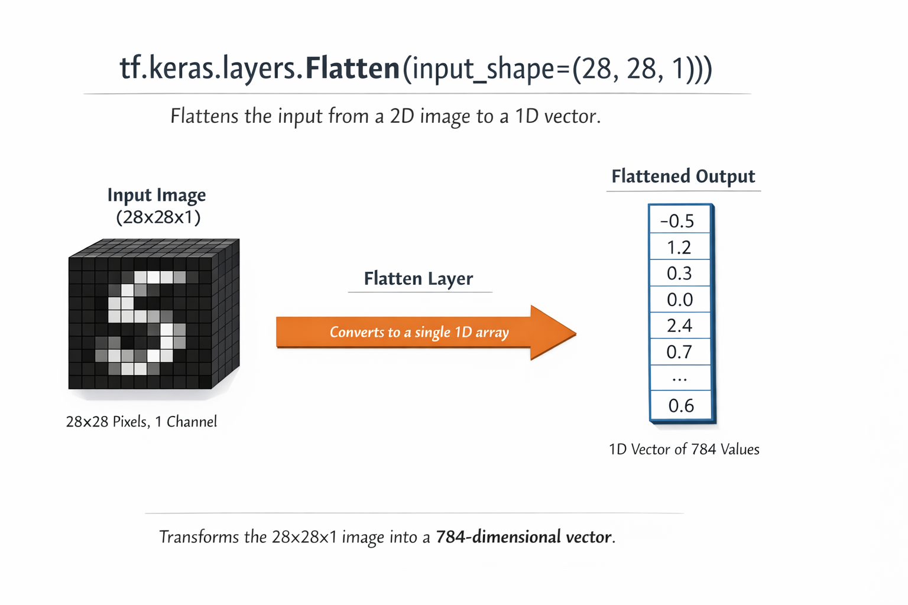


## tf.keras.layers.Dense()
#### takes the inputs provided to the model, calculate dot product of the inputs and weights add the bias
#### This is where we can apply activation function.
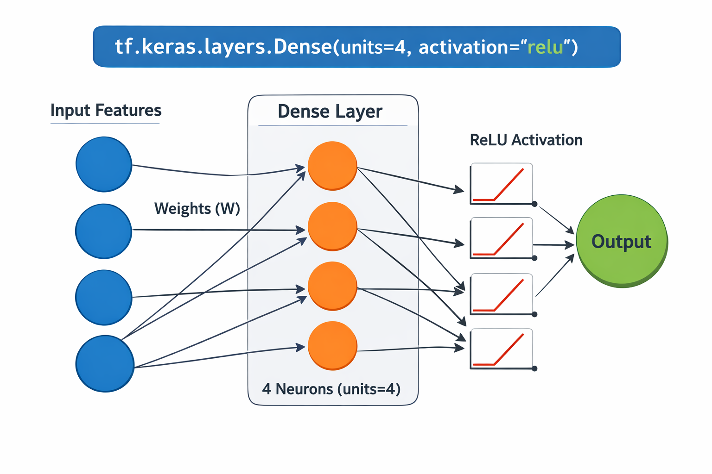
#### Dense is one of the most important layers in neural networks. It represents a fully connected layer, meaning:
#### 👉 Every neuron in this layer is connected to every neuron in the previous layer.
### 🧠 What it does
#### A Dense layer performs this operation:
```python
output=activation(W⋅x+b)
``` 
 - x → input
 - W → weights
 - b → bias
 - activation → optional function like ReLU, softmax, etc.
### 🧩 Basic Syntax
```python
    tf.keras.layers.Dense(units, activation=None)
```
#### Parameters:
 - units → number of neurons in the layer (very important!)
 - activation → function applied to output (optional)
### 📌 Example
```python
model = tf.keras.Sequential([
    tf.keras.layers.Flatten(input_shape=(28, 28, 1)),
    tf.keras.layers.Dense(128, activation='relu'),
    tf.keras.layers.Dense(10, activation='softmax')
])
```
#### What happens here:
 - Flatten → converts image to a 1D vector
 - Dense(128) → creates 128 neurons
 - Dense(10) → outputs 10 values (e.g., for 10 classes)

### 🧮 Shape Understanding
#### If input is:
```python
(batch_size, 784)
```
#### Then 
```python
Dense(128)
```
#### Output becomes:
```python
(batch_size, 128)
```
### 🔹 Step 1: What is a “shape”?
#### In deep learning, shape = dimensions of data.
```python
(28, 28, 1)
```
#### means:
 - 28 → height
 - 28 → width
 - 1 → channel (grayscale image)

### 🔹 Step 2: Batch dimension (VERY important)
#### Neural networks process multiple samples at once.
#### So actual input shape is:
```python
(batch_size, height, width, channels)
```
#### Example:
```python
(32, 28, 28, 1)
```
 - 32 images
 - each is 28×28 grayscale

### 🔹 Step 3: What Flatten does
#### After:
```python
Flatten()
```
#### Each image becomes a 1D vector
 - 👉 28 × 28 × 1 = 784
#### So shape becomes:
```python
(batch_size, 784)
```
#### Example:
```python
(32, 784)
```
### 🔹 Step 4: Now comes Dense layer
#### When you write:
```python
Dense(128)
```
#### It means:
 - 👉 “Take 784 inputs and convert them into 128 outputs”
### Core Idea (THIS is the key 🔥)
#### Dense layer transforms:
```python
(batch_size, input_features)
        ↓
(batch_size, units)
```
#### So:
```python
(32, 784) → Dense(128) → (32, 128)
```
### 🔹 Why does this happen?
#### Because internally:
 - Each of the 128 neurons connects to all 784 inputs
 - So each neuron produces one number
  - 👉 128 neurons = 128 output values
### 🔹 Simple analogy
#### Think of it like:
 - You have 784 exam scores
 - You summarize them into 128 insights
  - 👉 That’s what Dense layer does
### 🔹 One more full pipeline example
```python
Input:        (32, 28, 28, 1)
Flatten:      (32, 784)
Dense(128):   (32, 128)
Dense(10):    (32, 10)
```
#### Final output:
 - 10 values per image (for classification)
### 🔹 Most common confusion cleared
#### ❌ Wrong thinking:
 - Dense changes batch size
#### ✅ Correct:
 - Dense only changes feature dimension, not batch size
### 🔹 Quick memory trick 🧠
```python
Flatten → makes it long
Dense(n) → makes it n features
Batch size → never changes
```
### 🔥 Key Intuition
 - Dense layer = learning patterns
 - Each neuron learns some feature combination
 - More units = more learning capacity (but also more computation)

### ⚡ Quick Summary
 - Fully connected layer
 - Applies: weighted sum + activation
 - Used in almost all neural networks
 - Common activations:
   - 'relu' → hidden layers
   - 'softmax' → output (classification)

## 🧩 Step-by-step pipeline (Flatten → Dense)
### 🔹 1. Input Image
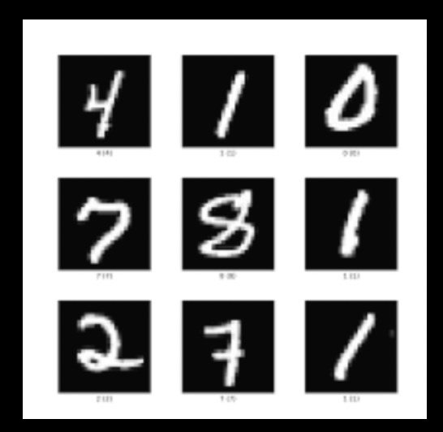
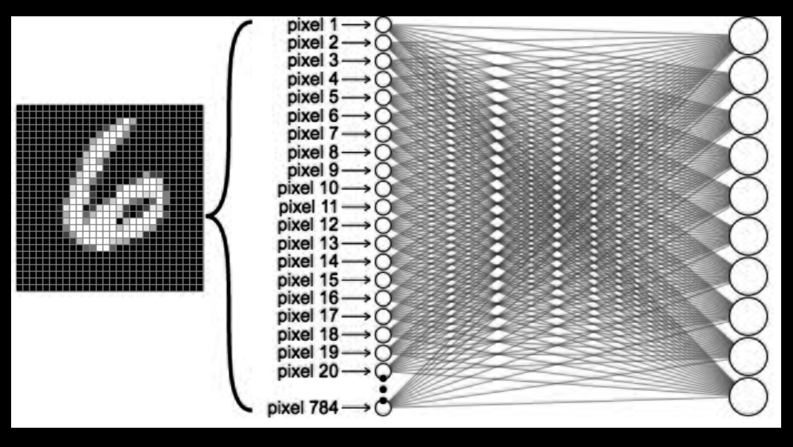
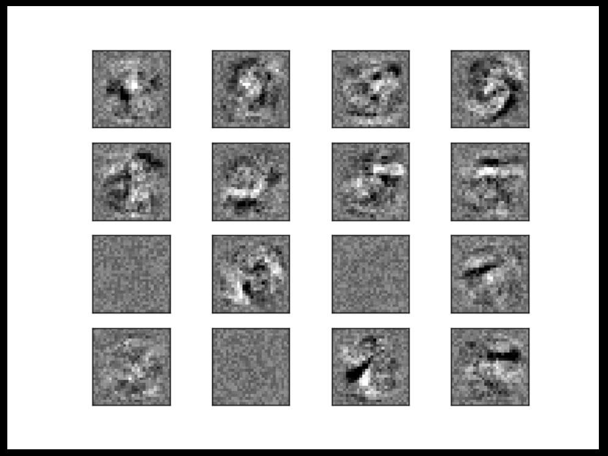
#### Shape:
```python
(28, 28, 1)
```
#### Think of it as:
 - A grid of 28×28 pixels
 - Each pixel = a number (0–255 or normalized)
### 🔹 2. Flatten Layer (convert to 1D)
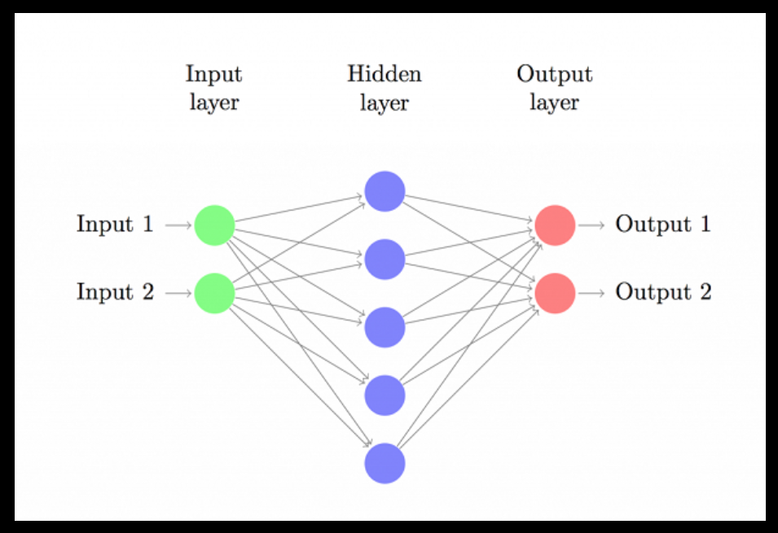
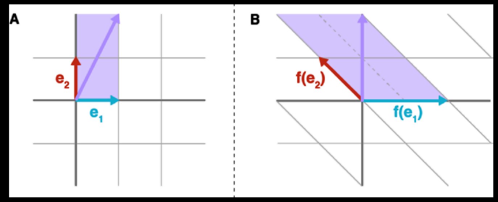
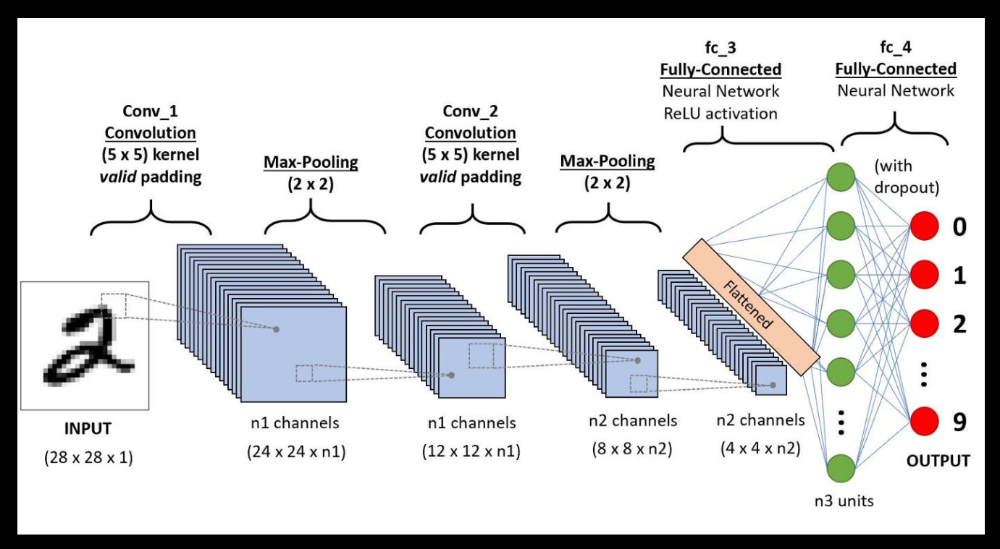
```python
Flatten()
```
#### What happens:
 - 28 × 28 × 1 → 784 values
 - It just rearranges data (no learning)
#### New shape:
```python
(784,)
```
#### 👉 Example:
```python
[ [1, 2],
  [3, 4] ]  →  [1, 2, 3, 4]
```
### 🔹 3. Dense Layer (fully connected)
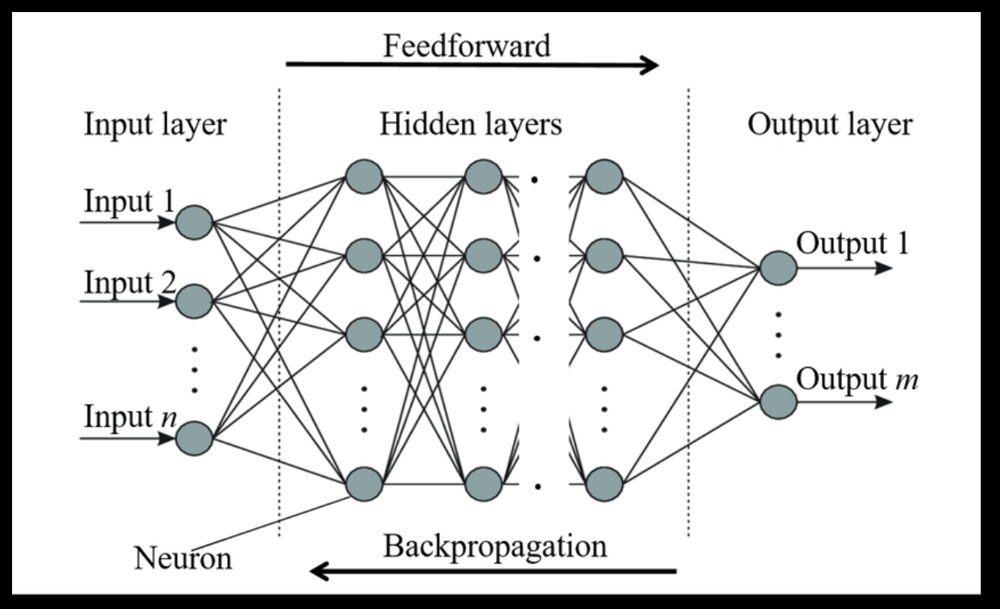
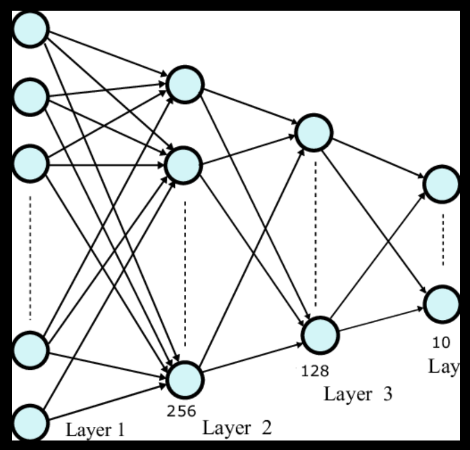
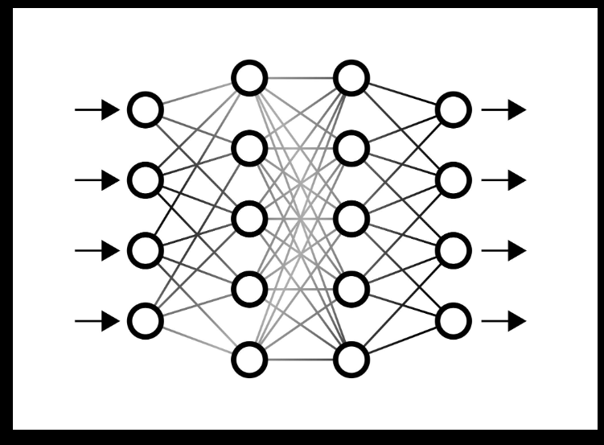
```python
Dense(128)
```
### What happens:
 - Input: 784 values
 - Output: 128 values
#### 👉 Each of the 128 neurons:
 - Takes all 784 inputs
 - Applies weights + bias
 - Produces 1 number
### 🔥 Internal connection (VERY important)
#### Each neuron does:
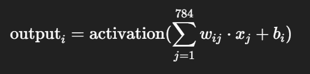
#### So:
 - 784 inputs → 1 neuron → 1 output
 - Repeat 128 times → 128 outputs
### 🔹 4. Final output shape
```python
(784,) → Dense(128) → (128,)
```
#### If batch is included:
````python
(32, 784) → (32, 128)
````
### 🧠 Full pipeline summary
```python
Image (28×28×1)
        ↓
Flatten
        ↓
Vector (784)
        ↓
Dense(128)
        ↓
Vector (128)
        ↓
Dense(10)
        ↓
Output (10 classes)
```
### 💡 Key intuition (this is the “aha” moment)
 - Flatten = just reshapes data (no learning)
 - Dense = learns patterns from that data
#### 👉 Flatten prepares data
#### 👉 Dense actually learns
### ⚡ Super simple analogy
 - Image = spreadsheet (28×28 cells)
 - Flatten = convert to one long row (784 cells)
 - Dense = analyze that row and extract insights

## 🧠 What is a Loss Function?
#### 👉 A loss function measures:
##### “How wrong is the model’s prediction?”
 - Low loss → good prediction
 - High loss → bad prediction
### 🎯 Main idea (VERY IMPORTANT)
#### 👉 You choose loss based on type of problem
| Problem Type                | Use This Loss            |
|-----------------------------|--------------------------|
| Regression (numbers)        | MSE / MAE                |
| Binary classification       | Binary Crossentropy      |
| Multi-class classification  | Categorical Crossentropy |
| Multi-label classification  | Binary Crossentropy      |

## 🔹 1. Regression Losses (predicting numbers)
### ✅ Mean Squared Error (MSE)
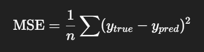
#### Use when:
 - Predicting continuous values
-  ##### 👉 house price, temperature, marks
#### Keras:
```python
loss = tf.keras.losses.MeanSquaredError()
```
#### Features:
 - Punishes large errors more (because of square)

### ✅ Mean Absolute Error (MAE)
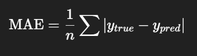
#### Use when:
 - You want robustness to outliers
```python
loss = tf.keras.losses.MeanAbsoluteError()
```
## 🔹 2. Binary Classification (2 classes)
### ✅ Binary Crossentropy
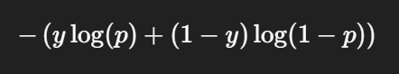
#### Use when:
 - Output is 0 or 1
   - spam / not spam
   - disease / no disease
   
```python
loss = tf.keras.losses.BinaryCrossentropy()
```
#### 👉 Output layer:
```python
Dense(1, activation='sigmoid')
```

## 🔹 3. Multi-class Classification (one correct class)
### ✅ Categorical Crossentropy
#### Use when:
 - One correct class out of many
   - 👉 digits (0–9), animal classification
```python
loss = tf.keras.losses.CategoricalCrossentropy()
```
#### 👉 Labels must be one-hot encoded:
````python
[0,0,1,0,0]
````
#### 👉 Output layer:
```python
Dense(num_classes, activation='softmax')
```

### ✅ Sparse Categorical Crossentropy (VERY COMMON 🔥)
#### Use when:
 - Labels are integers (not one-hot)
```python
loss = tf.keras.losses.SparseCategoricalCrossentropy()
```
#### 👉 Labels:
```python
2   # instead of [0,0,1,0,0]
```
#### 👉 This is used MOST in practice

## 🔹 4. Multi-label Classification
#### 👉 Example:
 - Image can have multiple tags
   - dog + outdoor + person
 #### ✅ Use:
```python
BinaryCrossentropy()
```
#### 👉 Output:
```python
Dense(n_labels, activation='sigmoid')
```
## 🔹 5. Special Losses (less common but useful)
### ✅ Hinge Loss
#### Used in SVM-style models
```python
tf.keras.losses.Hinge()
```
### ✅ Kullback-Leibler Divergence (KL Divergence)
#### Measures difference between probability distributions
```python
tf.keras.losses.KLDivergence()
```
### ✅ Huber Loss (mix of MSE + MAE)
#### Good when you want balance
```python
tf.keras.losses.Huber()
```
### 🚀 Quick Decision Guide
```python
Is output a number?
   → YES → MSE / MAE / Huber

Is it classification?
   → YES:
       2 classes → BinaryCrossentropy
       >2 classes:
           labels one-hot → CategoricalCrossentropy
           labels integers → SparseCategoricalCrossentropy
```

#### 🔥 Common mistakes (very important)
#### ❌ Using categorical_crossentropy with integer labels
#### ❌ Using softmax with binary classification
#### ❌ Using MSE for classification

### ⚡ Real-world example
```python
model.compile(
    optimizer='adam',
    loss='sparse_categorical_crossentropy',
    metrics=['accuracy']
)
```

#### 👉 Used for:
 - MNIST digit classification
 - CIFAR-10
 - Most beginner projects

#### 🧠 Final intuition
 - Loss = how you punish mistakes
 - Different problems need different punishments
